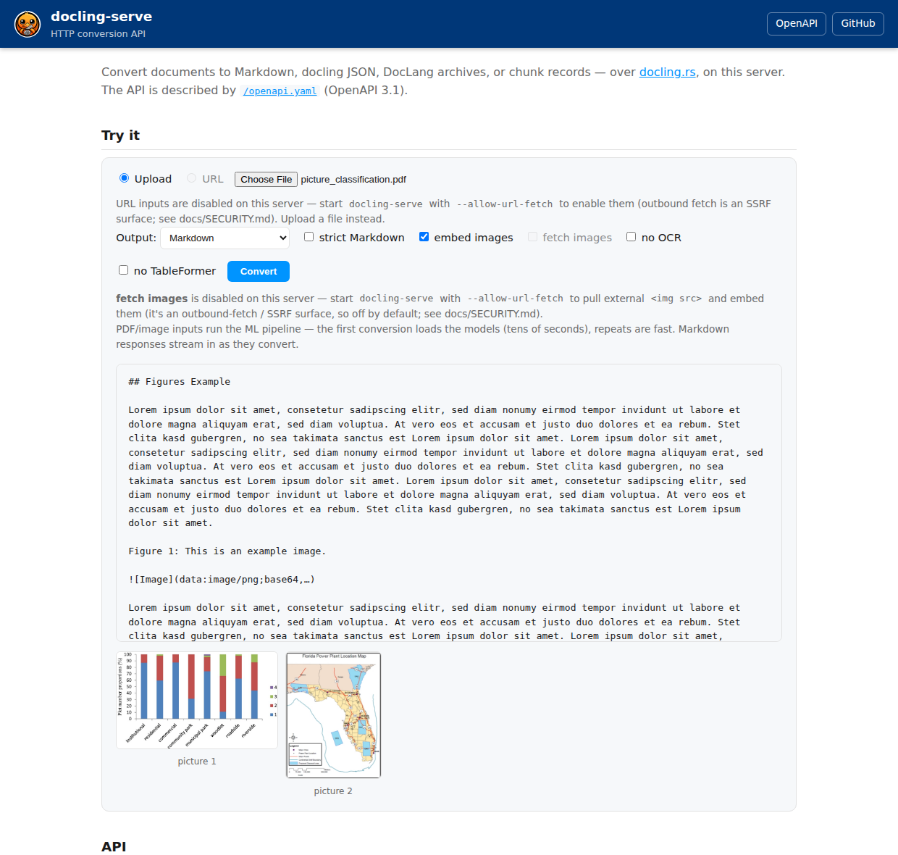

# docling.rs

<p align="center">
  
</p>

<p align="center">
  <a href="https://github.com/docling-project/docling.rs/actions/workflows/ci.yml"></a>
  <a href="https://docling-project.github.io/docling.rs/"></a>
  <a href="https://docs.rs/docling"></a>
  <a href="https://pypi.org/project/docling-rs/"></a>
  <a href="https://crates.io/crates/docling"></a>
  <a href="https://opensource.org/licenses/MIT"></a>
  <a href="https://lfaidata.foundation/projects/"></a>
  <br>
  <a href="https://crates.io/crates/docling"></a>
  <a href="https://pypi.org/project/docling-rs/"></a>
  <a href="https://www.npmjs.com/package/docling.rs"></a>
  <a href="https://www.npmjs.com/package/docling.rs-wasm"></a>
  <a href="https://github.com/docling-project/docling.rs/releases"></a>
  <br>
  <a href="https://github.com/docling-project/docling.rs/pkgs/container/docling-rs-serve"></a>
  <a href="https://github.com/docling-project/docling.rs/pkgs/container/docling-rs"></a>
  <a href="https://crates.io/crates/docling"></a>
  <a href="https://pepy.tech/projects/docling-rs"></a>
  <a href="https://www.npmjs.com/package/docling.rs"></a>
  
</p>

A Rust port of [docling](https://github.com/docling-project/docling): convert
documents into a unified `DoclingDocument` for downstream AI workflows.

**Fast and small:** one static binary, no Python/PyTorch at runtime. The PDF
ML pipeline runs **4.3× faster** than Python docling at **2.3–2.6× less peak
RAM** (methodology, profiling and per-fixture numbers in
[`docs/PDF_CONFORMANCE.md` § Performance](./docs/PDF_CONFORMANCE.md#performance--review--profiling-notes));
declarative formats (DOCX/HTML/XLSX/…) convert **20–60× faster** at
**~60× less memory** (measured with `scripts/test/performance.sh`, Python
docling vs Rust on the same file). Output is checked against upstream for
every format — see [Conformance with Python docling](#conformance-with-python-docling).

The format migration is **complete** — every document format in docling's
pipeline is supported, validated byte-for-byte against live docling. See
[`docs/MIGRATION.md`](./docs/MIGRATION.md) for the full architecture, the Python → Rust
mapping, and per-format conformance.

**▶ [Try it in your browser](https://docling-project.github.io/docling.rs/)** —
the whole converter compiled to wasm: drop a DOCX, PDF, XLSX, EPUB … and get
Markdown, docling JSON, DocLang XML, LaTeX or a Pandoc AST back. Nothing is uploaded; the page runs
entirely on your device, phone included. Scanned pages can be OCR'd there too
(layout + PP-OCR + TableFormer via ONNX Runtime Web, optionally on the GPU
through WebGPU) once you point it at the models. See
[`crates/docling-wasm`](./crates/docling-wasm/README.md).

Developed with **Claude Code** and _[TENET](https://github.com/artiz/tenet/tree/master)_ (minimalistic AI-driven development framework).

## Status

The public API works end to end across **Markdown, CSV, HTML, AsciiDoc, DOCX,
PPTX, XLSX, legacy DOC/XLS/PPT, Apple iWork, EPUB, ODF, RTF, WebVTT, Email, MHTML, JATS, USPTO,
XBRL, LaTeX, JSON, PDF, images, METS, audio and video** — with Markdown, docling-JSON,
plain text, DocLang `.dclx`, LaTeX, HTML, Pandoc AST and chunk output, plus image extraction. The full extension map (`InputFormat::from_extension`, mirroring
docling's `FormatToExtensions`) picks the backend; a file whose conversion
fails under its extension is checked by content and, when it is evidently
another format (an RTF, DOCX or HTML file saved as `.doc`, …), converted once
more as that format with a warning (#556) — files that convert as named are
never inspected:

| Category | Extensions |
|---|---|
| Text & markup | `.md` `.markdown` `.txt` `.text` `.qmd` `.rmd` · AsciiDoc `.adoc` `.asciidoc` `.asc` (text inputs decode like docling's `decode_text`: BOM, UTF-8, then windows-1252 — or the encoding you name with `--encoding shift_jis` / the `encoding` option, docling's `TextBackendOptions.encoding`) · HTML `.html` `.htm` `.xhtml` (any charset: BOM, declared `<meta charset>`, UTF-8, windows-1252 fallback; the JSON is docling's own tree — heading nesting, `inline` groups of formatted runs with `formatting`/`hyperlink`, rich table cells, `furniture` chrome — structurally identical to upstream's on the whole corpus) · MHTML `.mhtml` `.mht` · LaTeX `.tex` `.latex` |
| Word processing | DOCX `.docx` `.docm` `.dotx` `.dotm` (the JSON is docling's own tree — heading nesting, `inline` groups of formatting runs, list groups, rich cells, textbox/header/footer sections, comment back-refs — structurally identical to upstream's on the whole corpus; `mc:AlternateContent` is resolved before parsing — the modern `mc:Choice` the backend reads (text boxes, shape groups, 2010 extensions) over the `mc:Fallback`, body-level blocks included, #572) · Word 97–2004 `.doc` `.dot` (numbered headings keep their number, #641; text boxes, headers/footers and footnotes included; Word 6.0/95 files with their tables, headings, bold/italic, headers/footers and footnotes (#640; pictures and text boxes not yet); Word for Windows 1.x/2.0 flat files — `wIdent` 0xA5DB, the pre-OLE layout — as paragraphs, tables, bold/italic and the standard heading styles, #566/#573) · OpenDocument `.odt` `.ott` (flat `.fodt`) · OpenOffice 1.x `.sxw` `.stw` `.sxg` · StarWriter 3–5 `.sdw` `.vor` · AbiWord `.abw` `.zabw` `.awt` · WordPerfect 5.x/6.x+ `.wpd` `.wp` `.wp5` `.wp6` `.wpt` · Microsoft Works 2–9 `.wps` · EPUB `.epub` · RTF `.rtf` (equations — `{\mmath …}`, OMML spelled in control words — are LaTeX like DOCX's, inline `$…$` or a `$$…$$` formula, #578) |
| Presentations | PPTX `.pptx` `.pptm` `.potx` `.potm` `.ppsx` `.ppsm` (the JSON is docling's own tree — slide groups, `paragraph`/`title`/`list_item` items with docling's markers, list groups, non-empty table cells, pictures at the file's dpi, chart captions, notes and `comment_section` groups, every item's raw-EMU provenance — structurally identical to upstream's on the whole corpus; equations (`a14:m` OMML, which python-pptx and so docling drop) are LaTeX through the DOCX converter, a formula of their own or inline `$…$`, #575) · PowerPoint 97–2003 `.ppt` `.pot` `.pps` · OpenDocument `.odp` `.otp` (flat `.fodp`) · OpenOffice 1.x `.sxi` `.sti` · StarImpress/StarDraw 3–5 `.sdd` `.sda` |
| Diagrams | Visio `.vsdx` `.vsdm` — pages as sections, shape text in reading order, connectors as a relations table · SVG `.svg` — rasterized (resvg) into the image ML pipeline; without ML or with `--no-ocr` / `--text-layer-only`, `<text>` elements extract directly into reading-order paragraphs |
| Spreadsheets | XLSX `.xlsx` `.xlsm` (templates `.xltx` `.xltm`; cells print what Excel displays — `$12.50`, `10%`, `Feb-25` — by docling PR #4628's number-format rules, #634) · binary XLSB `.xlsb` · Excel 97–2004 `.xls` `.xlt` (number formats too) · OpenDocument `.ods` `.ots` (flat `.fods`) · OpenOffice 1.x `.sxc` `.stc` · CSV `.csv` `.tsv` · dBase `.dbf` · DIF `.dif` · SYLK `.slk` `.sylk` · Lotus 1-2-3 / Symphony `.wk1` `.wk2` `.wk3` `.wk4` `.wks` `.wrk` `.123` · Quattro Pro `.wq1` `.wq2` `.wb1` `.wb2` `.wb3` `.qpw` · MS Works 6–9 `.xlr` · MS Works `.wks` |
| Apple iWork | Pages `.pages` · Numbers `.numbers` · Keynote `.key` — Pages mirrors docling's reader (#318, #383): both generations (2013+ `Index/*.iwa` and iWork '09 `index.xml`), title/heading labels from paragraph styles, tables in the text flow, text boxes, lists, inline images, bold/italic/strike/links, headers/footers/footnotes (furniture) and reviewer comments (notes), byte-identical Markdown on upstream's corpus; Keynote mirrors docling's reader too (#466, docling 2.130+): charts (`TSCH.ChartDrawableArchive`, docling#4376) as pictures classified by kind with the chart's data as a table and its shown title as the caption — the shape the PPTX backend gives a chart; all three container generations (`Index/*.iwa`, the 2018+ nested `Index.zip`, iWork '09 `index.apxl`), a `chapter` group and a page per slide, drawables in reading order with their boxes, title placeholders as titles, theme-inherited bullets, tables, presenter notes and comments on the notes layer — exact Markdown and structurally identical JSON on upstream's corpus; Numbers is a text-level extension (#213): sheet/table names + cell text |
| XML dialects | JATS / USPTO / XBRL (`.xml` `.nxml`, content-sniffed) · DocLang `.dclg` |
| PDF & images | `.pdf` · `.png` `.jpg` `.jpeg` `.tif` `.tiff` `.bmp` `.webp` `.gif` · HEIC/HEIF `.heic` `.heif` (opt-in `--features heif`, links the system libheif — #211) · METS/GBS scan packages `.tar.gz` · DjVu `.djvu` `.djv` — pure-Rust decode (`djvu-rs`, MIT), the hidden per-page OCR text layer by default (deterministic, no models, works in wasm) with page provenance in the JSON (`pages` + per-paragraph `prov` from the text-layer zone boxes); a scan-only DjVu falls back to rasterize + OCR in the ML build (#434, a docling.rs extension — docling has no DjVu reader); a PDF's JSON carries its page headers and footers as `furniture`-layer items, and keeps the text inside a picture as that picture's children, as docling's does |
| docling native | docling JSON `.json` · DocTags `.doctags` `.dt` · DCLX `.dclx` |
| Mainframe data | EBCDIC `.ebc` `.ebcdic` — fixed-width record files decoded through a COBOL copybook layout (docling's `EbcdicLayout` JSON: cp037/cp500/cp1140 text, COMP/COMP-3/zoned numerics with implied decimal scale, multi-schema record-type prefixes); pass the layout via `ebcdic_layout` (inline JSON or path) or drop a `<stem>.layout.json` sidecar next to the file |
| Email & subtitles | `.eml` · Outlook `.msg` (CFB/MAPI, projected onto RFC 822 — same output as the equivalent `.eml`; optional `list_attachments` appends attachment names + content types; the payloads themselves through `EmailAttachments` / `convert_email_attachments`, py `email_attachments()`, Node `emailAttachments()` — #561, see "Email attachments" below) · WebVTT `.vtt` |
| Audio | `.wav` `.mp3` `.mpga` `.m4a` `.aac` `.ogg` `.flac` |
| Video | `.mp4` `.avi` `.mov` `.mkv` `.webm` `.mpeg` `.mpg` |

Raw **DocTags** (`.doctags`/`.dt` — the token markup docling's VLMs emit) reads
in through `docling-core`'s tolerant DocTags parser (#152), the same one the
VLM pipeline uses for model responses.
MHTML (docling's `InputFormat.MHTML`, docling#4184): saved-webpage
`.mhtml`/`.mht` archives are parsed as a MIME message with
[`mail-parser`](https://crates.io/crates/mail-parser) (which conforms to
[RFC 2557](https://datatracker.ietf.org/doc/html/rfc2557), the MHTML spec), the
`multipart/related` root part is selected the way docling selects it (`start`
parameter, `multipart/alternative`) and routed through the HTML backend; with
`--fetch-images` the archive's own image parts are embedded, resolved by
`Content-Location`/`cid:` like docling resolves them. The discriminative PDF/image pipeline
lives in `docling-pdf`: a pure-Rust PDF text parser and page-metadata reader
(page count, geometry, `/Rotate`, link annotations — all lopdf), a pure-Rust
page renderer for the page images the models see (paths, clips, embedded
and host fonts, shadings, patterns, images and widget appearances drawn in
docling-parse's frame with tiny-skia; the docling-parse renderer plugin —
the very canvas docling 2.123+ feeds them, #478 — is a development oracle
the conformance scripts ask for by name), and an ONNX layout/TableFormer/OCR
stack. Image-only pages —
scans — are rasterized byte for byte what pdfium renders (its stretch engine
and a libjpeg-exact JPEG decoder, ported; `DOCLING_RS_SCAN_RASTER=pdfium`
switches back). pdfium is gone from the default build: `.models/` alone
converts every PDF, the text layer has one source (the Rust parser), and no
native PDF library is fetched or linked. The opt-in `pdfium` cargo feature
brings the library back for `DOCLING_RS_RENDERER=pdfium` (docling's
pypdfium2 chain) and for a file lopdf cannot read
(`docs/PDF_CONFORMANCE.md`, "The PDF stack"; JPEG 2000 (`JPXDecode`) images
decode in pure Rust too (#598), JBIG2 draws as a placeholder). TableFormer is ported
to ONNX and run on every detected table region to recover its structure;
geometric reconstruction from cell positions remains only as the fallback when
the TableFormer graphs aren't present (see `docs/PDF_CONFORMANCE.md`).

**Audio/ASR** (docling's Whisper pipeline) lives in `docling-asr`, and it is
Rust all the way down: [`symphonia`](https://crates.io/crates/symphonia)
demuxes/decodes the container in-process (wav, mp3, flac, ogg, aac, m4a; no
ffmpeg), a ported log-mel front-end feeds a
**Whisper tiny** encoder/decoder exported to ONNX (run on `ort`, greedy with
OpenAI's timestamp rules — docling's ASR defaults), and each segment becomes a
`[time: start-end] text` paragraph in Markdown — in the JSON, docling 2.135's
text item (the words) with the timing as its `source` track, which `--to vtt`
turns into subtitles (#614). The transcription language is
auto-detected from the first 30 seconds (docling 2.116 parity); pin it with
`--asr-lang <code>` (a Whisper code like `en`, `de`, `zh`; `auto` re-enables
detection), the `asr_lang` option on the other surfaces, or the
`DOCLING_RS_ASR_LANG` environment variable. The `parakeet_tdt_0.6b_v3`
preset (#508) swaps Whisper for NVIDIA's **Parakeet TDT 0.6B v3** — a
FastConformer transducer for 25 European languages that detects the language
itself, with a 128-mel NeMo front-end, TDT greedy decoding with per-token
timestamps and Silero VAD segmentation; see
[Whisper and Parakeet models](#whisper-and-parakeet-models-for-audioasr). **Video** inputs (`mp4`/`mov`/`mkv`/`webm`, docling's
`InputFormat.VIDEO`) take the same path: symphonia demuxes the audio track
(isomp4/Matroska readers) and the transcript becomes the document. When the
`ffmpeg` **binary** is present (runtime detection — no build dependency;
`DOCLING_FFMPEG` overrides the path), up to `--video-frames N` frames (default
8) are also sampled — scene changes first, spread over the whole duration
when there are more cuts than frames (#648), evenly spaced fallback — and
interleave with the transcript as `[time: <ts>]`-captioned pictures, PNGs
embedded in JSON/DCLX output. Without ffmpeg, or with `--video-frames 0`, a
video converts to its transcript alone; a video with *no* audio track converts
to its frames alone. The sampling is tunable (#647, every surface):
`--video-frames all` keeps every distinct cut instead of a cap,
`--video-scene-threshold X` sets ffmpeg's scene score a frame must exceed to
be a cut (0.27; 0.6 keeps hard cuts only), `--video-frame-max-side PX`
downscales each frame inside ffmpeg (a 1080p recording at 640 → 640×360
PNGs), and `--video-frame-dedupe N` drops a frame whose difference hash is
within N bits of a kept one (the same slide after a fade becomes one
picture; 4–6 is a good distance). Frames are decoded one at a time and each
goes through the picture enrichment before the next is decoded, so
`--picture-ocr --no-picture-images` reads a 300-frame lecture with one frame
in memory. What symphonia can't decode in-process — Ogg **Opus**
(the codec of Telegram/WhatsApp voice messages) and **AVI** containers —
falls back to the same optional ffmpeg binary when present; without ffmpeg
those inputs fail with a targeted message and an install hint.

**XBRL** (SEC-style financial instance documents, content-sniffed from `.xml`)
converts without arelle: the `dei` facts make the title, each
`textBlockItemType` fact is an HTML fragment converted in place, and the
numeric facts end the document as docling's key-value graph (`GraphData`
in the JSON, one key cell per fact over its value, period, unit and
decimals cells, plus the concept hierarchy from the taxonomy's presentation
and calculation linkbases — the Markdown carries docling's
`<!-- missing-key-value-item -->` placeholder there). The taxonomy is read
offline from `--xbrl-taxonomy DIR` (`xbrl_taxonomy` on the other surfaces,
docling's `XBRLBackendOptions.taxonomy`): the extension schema and linkbases
at the relative paths the instance's `schemaRef` names, plus taxonomy
packages (`.zip` with a `META-INF/catalog.xml`) mapping the base taxonomies'
URLs to files. Without the option the instance's own directory is searched;
whatever cannot be found only costs the graph its hierarchy links.

**LaTeX** (`.tex`) is docling's `LatexDocumentBackend` ported handler for
handler on a port of pylatexenc's tolerant `LatexWalker`, so a multi-file
arXiv project converts the way upstream converts it: the preamble's
`\title`/`\author`, sectioning, paragraphs, inline and display math,
`\newcommand` expansion, `\input`/`\include` files parsed in place (kept
inside the source's directory), lists, `thebibliography`, `tabular` grids,
figures whose `\includegraphics` becomes an `Image: <path>` caption over a
picture — a raster file embedded as PNG, a PDF figure left without a payload
(upstream renders it with pypdfium2). The six arXiv papers upstream tests on
are Markdown-exact and, but for those PDF payloads, JSON-identical.

<details>
<summary><b>Installing ffmpeg</b> (optional — only for video frame sampling)</summary>

Any ffmpeg ≥ 4.x on `PATH` works; docling.rs shells out to the binary and
parses its output, so no dev headers/libraries are needed.

- **Debian/Ubuntu**: `sudo apt-get install ffmpeg`
- **Fedora**: `sudo dnf install ffmpeg-free` (or `ffmpeg` from RPM Fusion)
- **Alpine**: `apk add ffmpeg`
- **macOS**: `brew install ffmpeg`
- **Windows**: `winget install ffmpeg` (or `choco install ffmpeg`, or
  `scoop install ffmpeg`). Installing from a downloaded zip
  ([gyan.dev](https://www.gyan.dev/ffmpeg/builds/) /
  [BtbN](https://github.com/BtbN/FFmpeg-Builds/releases)) also works — either
  add the extracted `bin\` folder to `PATH`, or skip `PATH` entirely and point
  `DOCLING_FFMPEG` at the exe:
  `set DOCLING_FFMPEG=C:\tools\ffmpeg\bin\ffmpeg.exe`

Check with `ffmpeg -version`. `DOCLING_FFMPEG` overrides the binary used on
any OS; the docling-rs-serve Docker image ships ffmpeg preinstalled.
</details>

## Conformance with Python docling

Every output is checked against upstream Python docling. Declarative formats
are compared byte-for-byte against the live library; the PDF/image ML pipeline
is pinned by a deterministic snapshot baseline and scored against docling's
groundtruth in [`docs/PDF_CONFORMANCE.md`](./docs/PDF_CONFORMANCE.md).

Latest full sweep of the declarative corpus, docling **2.129.0**
(`scripts/conformance/full_conformance.py`: Markdown byte-for-byte, JSON
structurally — every key and value but `origin`/`version` and re-encoded image
bytes; ✅ all = every file of the format matches):

| Format | Files | Markdown exact | JSON identical |
|---|---|---|---|
| DOCX | 36 | ✅ all | 35 |
| HTML | 32 | ✅ all | 31 |
| PPTX | 8 | ✅ all | ✅ all |
| XLSX | 13 | ✅ all | ✅ all |
| ODF | 7 | ✅ all | 6 |
| CSV | 9 | ✅ all | 6 |
| Markdown | 10 | ✅ all | 5 |
| DeepSeek-OCR Markdown | 3 | ✅ all | n/a |
| WebVTT | 4 | ✅ all | ✅ all |
| Email (`.eml`) | 2 | ✅ all | ✅ all |
| iWork Pages | 1 | ✅ all | ✅ all |
| iWork Keynote | 5 | ✅ all | ✅ all |
| EBCDIC | 3 | ✅ all | ✅ all |
| JATS | 7 | ✅ all | ✅ all |
| DocLang | 15 | ✅ all | ✅ all |
| AsciiDoc | 4 | ✅ all | ✅ all |
| USPTO | 9 | ✅ all | ✅ all |
| EPUB | 1 | ✅ all | ✅ all |
| LaTeX | 8 | ✅ all | 7 ¹ |

¹ `1706.03762`: one `tabular`'s cells carry consistent `row_span`/`col_span` where upstream writes the span into the offsets only; PDF figures carry no image payload (upstream renders them with pypdfium2).

The JSON column is complete wherever the backend builds docling's item tree
(HTML, DOCX, PPTX, ODF, WebVTT, JATS, AsciiDoc, DocLang, LaTeX, USPTO,
Markdown without raw HTML blocks) or its flat export already has upstream's
shape (XLSX, CSV, EBCDIC); the partial columns are listed with their exact
files in [`docs/MIGRATION.md`](./docs/MIGRATION.md). Markdown is exact on
every file upstream itself converts (the tenth USPTO fixture,
`tables_ipa20180000016.xml`, fails in upstream). Per-format residuals, with the exact files:
[`docs/MIGRATION.md`](./docs/MIGRATION.md).

## RAG subsystem

[`crates/docling-rag`](./crates/docling-rag) builds a pluggable
Retrieval-Augmented-Generation layer on top of the converter: it turns documents
into Markdown, chunks them (streaming sliding window, or docling's
hierarchical/hybrid chunkers via `RAG_CHUNKER`), embeds the chunks, and
stores them in a vector database for semantic search. Every external dependency is
a swappable trait — embedders (**Ollama**/Gemini/local-ONNX), vector stores
(**SQLite+sqlite-vec**/PostgreSQL+pgvector), LLM (**OpenRouter**, `deepseek/deepseek-chat` by default),
document sources (**folder**/FTP/SFTP), and message queues
(**in-process**/RabbitMQ/Redis). It ships Hybrid, Multi-Query fusion and HyDE
retrieval plus an evaluation harness to compare configurations and an
API-key-protected REST API (`docling-rag serve`) for document info and
search — with a built-in single-page search UI at `GET /` (API key stored in
the browser's localStorage). A `--features cuda` build runs ingest conversion
*and* the local ONNX embedder on the GPU via the same `DOCLING_RS_EP` switch
as the rest of the stack. Configure it via [`.env`](./.env.example); see the
[crate README](./crates/docling-rag/README.md) for a quickstart on any
documents folder.

## HTTP conversion API — `docling-rs serve`

[`crates/docling-serve`](./crates/docling-serve) is the analogue of Python's
`docling-serve`: a long-running server exposing the converter over HTTP. One
warm PDF/image pipeline (layout/OCR/TableFormer stay loaded) is shared across
requests, so repeat PDF conversions skip the model load (~13× faster than a
cold call on the test fixtures); a semaphore bounds concurrent conversions.
Markdown responses stream (chunked transfer); `/health` + `/ready` suit
container probes, and SIGTERM drains in-flight requests before exit.
`GET /` serves API docs plus an interactive test form — upload or URL in,
streamed result out, with extracted pictures rendered below the text — and
`GET /openapi.yaml` describes the whole API (OpenAPI 3.1), so Swagger UI,
Redoc or a client generator can be pointed straight at a running server:

<p align="center">
  
</p>

```bash
cargo run --release -p docling-serve                 # 127.0.0.1:5001
# or: cargo run --release -p docling-cli --features serve -- serve

curl -F file=@paper.pdf localhost:5001/v1/convert                # Markdown
curl -F file=@report.docx 'localhost:5001/v1/convert?to=json'    # docling JSON
curl -F file=@sheet.xlsx  'localhost:5001/v1/convert?to=dclx' -O # DocLang archive
curl -F file=@page.html   'localhost:5001/v1/convert?to=chunks'  # chunk records
curl -F file=@paper.pdf   'localhost:5001/v1/convert?to=images&pages=1-3'  # pages → PNG (base64 JSON)
curl -H 'content-type: application/json' \
     -d '{"url": "https://example.com/doc.pdf", "to": "md"}' \
     localhost:5001/v1/convert     # fetch a URL (needs --allow-url-fetch)

curl -F file=@a.pdf -F file=@b.docx localhost:5001/v1/convert    # batch → JSON results array
curl -F file=@bundle.zip localhost:5001/v1/convert                # every document inside, as a batch (#557)

id=$(curl -F file=@big.pdf localhost:5001/v1/convert/async | jq -r .task_id)
curl localhost:5001/v1/status/$id                                # pending|started|success|failure
curl localhost:5001/v1/result/$id                                # the output, once done
```

Long conversions don't have to hold the connection: `POST /v1/convert/async`
accepts the same request and returns a task id immediately — poll
`/v1/status/{id}`, fetch `/v1/result/{id}` (kept `--result-ttl` seconds,
default 10 min; at most `--queue-size` jobs queue at once). Several `file`
parts in one request convert as a batch with per-item status. PDF/image
responses carry a conversion-confidence report (docling-serve v1.25 parity):
an `X-Docling-Confidence` summary header (grades `poor`/`fair`/`good`/
`excellent` + layout/OCR/parse scores) on every format, and the full per-page
report under a top-level `confidence` key in `to=json` bodies.

### Drop-in for docling-serve (Open WebUI, n8n, Dify, LangChain)

Clients written against Python docling-serve's API talk to this server
unchanged (#615). It serves upstream's routes next to its own `/v1/convert`:

| Route | Takes | Answers |
|---|---|---|
| `POST /v1/convert/file` | multipart `files` (repeatable) + option fields | docling's `ConvertDocumentResponse` |
| `POST /v1/convert/source` | JSON `{"sources": [{"kind": "file"\|"http", …}], "options": {…}, "target": {"kind": "inbody"\|"zip"}}` (also 0.x `file_sources` / `http_sources`) | the same |
| `POST /v1/convert/{file,source}/async` | the same | `TaskStatusResponse` (`task_id`, `task_status`, …) |
| `GET /v1/status/poll/{task_id}` · `GET /v1/result/{task_id}` | — | the task's status · its `ConvertDocumentResponse` |
| `/v1alpha/…` | aliases of the above for docling-serve 0.x clients | |

One document answers `{"document": {"filename", "md_content", "json_content",
"html_content", "text_content", "doctags_content", "doclang_content"},
"status", "errors", "processing_time", "timings"}` with the `to_formats`
asked for (default `md`) filled and the rest `null`; several documents (or
`target_type=zip`) a zip of `<stem>.<ext>` files. A document that fails to
convert is still a **200** with `status: "failure"` and the reason in
`errors[0].error_message`, which is where these clients look. Options take
upstream's names and types: `do_ocr`, `force_ocr`, `do_table_structure`,
`page_range`, `image_export_mode` (default `embedded`, as upstream),
`md_page_break_placeholder`, `do_pdf_heading_hierarchy`, `md_compact_tables`,
the `do_*_enrichment` switches, `document_timeout`, `images_scale`,
`pipeline=vlm`, `ocr_engine` (the Tesseract spellings select Tesseract;
EasyOCR / RapidOCR / ocrmac use the built-in PP-OCR) and `ocr_lang` (the
first code this build reads). Anything this server has no equivalent for —
`pdf_backend`, `table_mode`, `abort_on_error`, picture-description and preset
knobs — is accepted and ignored, so a client's extra parameters never fail a
conversion. This server's own option names (`strict`, `password`, …) work
there too. `doctags_content` stays `null`: there is no DocTags writer
(`doclang_content` carries its successor). `--api-key KEY`, or upstream's
`DOCLING_SERVE_API_KEY`, requires `X-Api-Key` on every `/v1` route; `/health`,
`/ready`, `/metrics` and the docs page stay open.

**Open WebUI**: *Admin Settings → Documents → Content Extraction Engine =
Docling*, *Docling Server URL* = `http://<host>:5001` (and the API key if you
set one). Its loader posts `files` with `image_export_mode=placeholder` and a
form-feed `md_page_break_placeholder`, and reads `document.md_content` split
into pages. Extra *Docling parameters* JSON (`{"do_ocr": true, "ocr_lang":
["en"], "pdf_backend": "dlparse_v4"}`) is mapped where it means something here
and ignored otherwise.

```bash
curl -F files=@report.pdf -F to_formats=md -F to_formats=text \
     localhost:5001/v1/convert/file | jq '.status, .document.text_content'
curl -H 'content-type: application/json' localhost:5001/v1/convert/source \
     -d '{"sources": [{"kind": "http", "url": "https://arxiv.org/pdf/2206.01062"}],
          "options": {"to_formats": ["md"], "do_ocr": false}}'  # needs --allow-url-fetch
```

A conversion that *panics* — a backend bug reached on some input — answers
**500** with the error body, on every endpoint, instead of leaving the caller
with a silent empty 200 or a hanging request (#396). The panic still prints its
message and backtrace to the server log, and the batch CLI reports that file as
failed and moves on to the next one.

`to=images` skips conversion entirely and rasterizes a PDF's pages to PNG —
`{"pages": [{"page", "width", "height", "png_base64"}]}` —
honoring `pages=A-B` and a `scale` of 0.1–4.0 pixels per PDF point (default
2.0 = 144 dpi). Capped at 100 pages per request
(`DOCLING_RS_MAX_RASTER_PAGES`); narrow big documents with `pages`.

Options per request: `to=md|json|html|text|dclx|chunks|latex|pandoc|images` (`pandoc_api_version` checks the Pandoc API a `to=pandoc` caller expects), `strict`, `images=placeholder|embedded`,
`skip_empty_cells`, `compact_tables`, `md_page_break_placeholder` (text between pages in Markdown),
`no_ocr` (docling's `--no-ocr`; `skip_ocr` its pre-2.0 name), `text_layer_only`, `password` (`pdf_password` too), `no_table_former`, `no_text_panels`, `heading_hierarchy`, `force_full_page_ocr`, `pages`,
`do_picture_classification`, `do_code_enrichment`, `do_formula_enrichment` (#423: the
[enrichment models](#enrichment-models-picture-classification-code-formulas), named as
docling's `PdfPipelineOptions` flags; a request that changes the enrichment mix rebuilds the
warm pipeline once, the models themselves load lazily on the first matching region),
`do_picture_ocr`, `picture_ocr_classes`, `picture_ocr_min_side`, `keep_picture_images` (#645:
[OCR the pictures of non-PDF documents](#picture-ocr-for-non-pdf-documents---picture-ocr)),
`redact_pii`, `redact_mode`, `redact_kinds`, `redact_pattern`, `redact_images` (#621:
[PII redaction](#pii-redaction---redact-pii) before any export; the counts come back in
`X-Docling-Redaction` / the item's `redaction`),
`ocr_lang`, `ocr_engine`, `ocr_mode`, `ocr_scale`, `scale`, `document_timeout` (#497: a per-document budget in seconds — a cut conversion answers `X-Docling-Status: partial_success` + `X-Docling-Errors`, batch / async items carry `status` and `errors`), `asr_model`, `asr_lang`, `encoding`, `video_frames`, `image_sources` (#646: `remote` needs `--allow-url-fetch` — else held to `embedded` — and `local` needs `--allow-local-images`), `image_hosts`, `max_images` / `max_image_bytes` / `max_image_total_mb` / `min_image_bytes`, `xbrl_taxonomy`, `fetch_images`,
`chunker=hierarchical|hybrid`, `chunk_tokenizer`, `chunk_max_tokens`, `chunk_merge_peers` (#256:
per-request `to=chunks` configuration; the tokenizer is a server-local relative path),
`pipeline=standard|vlm` + `vlm_endpoint`, `vlm_model`, `vlm_api_key`, `vlm_prompt`,
`vlm_max_tokens` (#304: the remote [VLM pipeline](#vlm-pipeline-remote-endpoint); a
request-supplied `vlm_endpoint` needs `--allow-url-fetch` and passes the same SSRF
check as URL inputs — pin it server-side via `DOCLING_RS_VLM_*` instead for the safer
operator-controlled mode) — as query
parameters, multipart fields, or JSON keys (body wins). Server flags: `--addr`,
`--concurrency`, `--max-body-mb`, `--queue-size`, `--result-ttl`, `--warmup`,
`--allow-url-fetch`, `--no-url-fetch`, `--strict`, `--api-key` (#615:
`X-Api-Key` on every `/v1` route; `DOCLING_SERVE_API_KEY` when absent),
`--max-memory-mb` (#263:
memory ceiling for admission control — explicit, or `DOCLING_RS_MAX_MEMORY_MB`,
else the container's cgroup limit; once RSS crosses 85% of it — tunable via
`DOCLING_RS_MEMORY_WATERMARK_PCT` — new conversions get 503 + Retry-After
instead of OOM-killing the process; `0` disables). Thread pools are
**cgroup-quota-aware** (#262; `DOCLING_RS_TF_INTRA` further narrows the shared
TableFormer session — the reporter's 4-CPU case dropped ~40% peak memory), and
the server defaults `DOCLING_RS_NO_ARENA=1`: with the ONNX CPU arena off plus
heap trimming, warm retained RSS measured ~3× lower (2.0 GB → 0.7 GB) at no
latency cost — set `DOCLING_RS_NO_ARENA=0` to restore the arena. Prebuilt
multi-arch images (`linux/amd64`, `linux/arm64`) publish to GHCR:
`ghcr.io/docling-project/docling-rs-serve:latest` (the server) and
`ghcr.io/docling-project/docling-rs:latest` (the CLI, `docker run --rm -v
"$PWD:/data" ghcr.io/docling-project/docling-rs report.pdf --to md`), both
built from [`crates/docling-serve/Dockerfile`](./crates/docling-serve/Dockerfile)
with the models baked in (or mountable with `--build-arg
FETCH_ASSETS=0`; extra speech-recognition presets with `--build-arg
ASR_MODELS=parakeet_tdt_0.6b_v3`). Docker
Compose setups are in [`examples/docker-compose/`](./examples/docker-compose/) and
the full guide is in [`docs/DEPLOYMENT.md`](./docs/DEPLOYMENT.md).
URL inputs are **off by default** (SSRF surface): pass `--allow-url-fetch` to
enable them; the fetcher blocks private-IP targets
(`DOCLING_RS_ALLOW_PRIVATE_IP_FETCH=1` opts out) and caps the download size
(`DOCLING_RS_MAX_FETCH_BYTES`). The server binds loopback by default — front
it with a policy proxy for anything wider.
The JSON body also takes docling's service-datamodel `sources`/`target` shape
(#139): `kind`-tagged `file` (base64) and `http` (URL + headers) sources, and —
with the opt-in `cloud` cargo feature (feature-gated `object_store`) — `s3`,
`azure_blob` and `google_cloud_storage` sources and output targets, coordinate
fields mirroring upstream's models. A cloud target uploads each converted
output as `<stem>.<ext>` under the prefix and answers with a
`RemoteTargetResult` acknowledgment; everything outbound sits behind
`--allow-url-fetch`. The jobkit targets `zip` and `put` work too (#303, no
`cloud` feature needed): `{"kind": "zip"}` answers with one `application/zip`
archive of the `<stem>.<ext>` rendered outputs (a batch download — nothing
outbound, no gate; a failed batch item becomes a `<stem>.<ext>.error.txt`
entry), and `{"kind": "put", "url": …}` HTTP-PUTs each rendered output to the
given — typically pre-signed — URL, so upload credentials live in the URL the
caller minted, never in the request (behind `--allow-url-fetch`, with the same
SSRF resolution check as URL inputs and redirects disabled). See the
`s3_pipeline` example in `/openapi.yaml`.

Observability (#297, mirroring Python docling-serve's posture — metrics on by
default, traces opt-in): every request logs through `tracing` (`RUST_LOG`
filters, default `info`), and `GET /metrics` serves Prometheus text —
request counts by status class, an in-flight gauge, a request-latency
histogram, and per-outcome conversion counts (`/metrics`, `/health` and
`/ready` probes excluded). Building with the opt-in `otel` cargo feature and
setting `OTEL_EXPORTER_OTLP_ENDPOINT` additionally ships the request spans
over OTLP/gRPC (`OTEL_SERVICE_NAME` defaults to `docling-rs-serve`); without the
env var the feature is inert.

## In the browser — `docling-wasm`

The declarative converters (everything except the PDF/image/audio ML
pipelines) compile to `wasm32-unknown-unknown`:
[`crates/docling-wasm`](./crates/docling-wasm) exposes
`convert(bytes, filename, to)` → Markdown / docling JSON / DocLang / LaTeX / HTML / Pandoc AST via
`wasm-bindgen`, so DOCX/HTML/XLSX/PPTX/EPUB/… convert **fully client-side** —
no server, ~3.4 MB gzipped module, no models to download for the declarative
formats (the default-on browser-OCR feature does fetch its ONNX models) —
something Python docling has no equivalent for. Ready to use from npm:

```bash
npm i docling.rs-wasm
```

```js
import { convert } from "docling.rs-wasm";          // bundlers
// import init, { convert } from "docling.rs-wasm/web"; await init();  // no bundler
const markdown = convert(bytes, file.name, "md");
``` Digital PDFs convert too: the wasm build always compiles docling-pdf's
pure-Rust text-layer parser (the `pdf-text` feature of the `docling` crate;
the same extraction as `--text-layer-only`: flat paragraphs, no headings/tables/pictures),
while scanned PDFs get a clear "needs OCR" error instead of an empty
document. The crate ships a drop-a-file demo page under
[`www/`](./crates/docling-wasm/www). Native builds are untouched: the
feature slices behind this (`pdf` / `asr` / `fetch-images`) all stay in the
`docling` default set, so a plain `cargo build` is unchanged.

## Integration — using docling.rs from your language

One engine, several front doors. Every surface takes the same options
(`to`, `strict`, `images`, `no_ocr`, `ocr_mode`, `heading_hierarchy`,
`pages`, …) and returns the same outputs (Markdown, docling JSON, DocLang
`.dclx`, LaTeX, HTML, Pandoc AST, chunk records).

| You write… | Use | Install | Details |
|---|---|---|---|
| Rust | the `docling` crate: `DocumentConverter` + `SourceDocument` | `cargo add docling` | [The API](#the-api) |
| a shell / CI job | the `docling-rs` CLI (`--to md\|json\|html\|dclx\|chunks\|latex\|pandoc\|images`, `--input`/`--output` batch mode) | `cargo install docling-cli` · [release binaries](https://github.com/docling-project/docling.rs/releases) · `ghcr.io/docling-project/docling-rs` | [Batch conversion](#batch-conversion--input----output), [Install](#install-locally--in-ci-one-liner) |
| anything that speaks HTTP | `docling-serve`: `POST /v1/convert` (multipart or JSON), async jobs, OpenAPI 3.1 | `docker run -p 5001:5001 ghcr.io/docling-project/docling-rs-serve` · `cargo install docling-serve` | [HTTP conversion API](#http-conversion-api--docling-rs-serve), [docs/DEPLOYMENT.md](./docs/DEPLOYMENT.md) |
| Node.js / Bun / Electron | `docling.rs` (N-API addon): `convertFile`, `convert`, streaming, chunking, warm `Pipeline` | `npm i docling.rs` (`docling.rs-cuda` for GPU) | [Node bindings](#nodejs--bun-bindings), [crate README](./crates/docling-node/README.md) |
| Python | `docling-rs` — a drop-in for docling's `DocumentConverter` over the Rust engine | `pip install docling-rs` (`docling-rs-cuda` for GPU) | [Python bindings](#python-bindings), [migration guide](./crates/docling-py/README.md#migrating-from-python-docling) |
| the browser / Tauri / a PWA | `docling.rs-wasm`: `convert(bytes, name, to)` fully client-side, optional in-browser OCR/layout | `npm i docling.rs-wasm` | [In the browser](#in-the-browser--docling-wasm), [crate README](./crates/docling-wasm/README.md) |
| C, C++, C#/.NET, Go, Java, Swift, Zig, … | `docling-ffi`: `docling_convert(bytes, len, filename, options_json)` behind one `docling.h` | [release archives](https://github.com/docling-project/docling.rs/releases) `docling-ffi-<tag>-<target>` (library + header) | [C ABI](#c-abi-for-embedders--docling-ffi), [language quickstarts](./crates/docling-ffi/README.md#language-quickstarts) |
| a RAG stack | `docling-rag`: chunk → embed → search, REST API and web UI | `cargo install docling-rag` | [RAG subsystem](#rag-subsystem) |
| a LangChain pipeline | `docling_rs.langchain.DoclingLoader` — langchain-docling's loader (and picture descriptions) on the Rust engine | `pip install "docling-rs[langchain]"` | [Python bindings](#python-bindings), [examples](./crates/docling-py/examples/langchain/) |

Which one to pick: **Rust** when you're already in Cargo; **CLI** for scripts
and batch jobs (the ML models load once per run); **serve** when several
services or languages share one warm pipeline — models stay loaded, admission
control keeps memory bounded, and every language has an HTTP client;
**Node / Python** for in-process use from those runtimes with zero extra
services; **wasm** when the document must not leave the user's machine;
**FFI** for everything else that can call a C function. The ML assets
(`.models/`) are the same for all of them — see
[Getting the ML models](#getting-the-ml-models); the Python and Node packages
fetch them on first use, the container images ship them baked in.

```bash
# CLI
docling-rs report.pdf --to md
docling-rs --input ./docs --output ./out --to latex
docling-rs --help        # every flag; --version reports the compiled-in features
docling-rs --list-input-formats    # extensions this binary converts, one per line
docling-rs --list-output-formats   # the --to values, one per line

# HTTP
curl -F file=@report.pdf 'localhost:5001/v1/convert?to=json&heading_hierarchy=true'
```

```js
// Node.js / Bun
import { convertFile } from 'docling.rs'
const { content } = convertFile('report.pdf', { to: 'markdown' })
```

```python
# Python — docling-shaped
from docling_rs import DocumentConverter
doc = DocumentConverter().convert("report.pdf").document
print(doc.export_to_markdown())
```

```js
// Browser (wasm) — nothing leaves the page
import init, { convert } from "docling.rs-wasm/web";
await init();
const tex = convert(new Uint8Array(await file.arrayBuffer()), file.name, "latex");
```

```c
/* C ABI — any language with FFI */
DoclingResult *r = docling_convert(bytes, len, "report.docx", "{\"to\":\"json\"}");
if (!docling_result_error(r)) fwrite(docling_result_output(r), 1, docling_result_output_len(r), stdout);
docling_result_free(r);
```

## The API

```rust
use docling::{DocumentConverter, SourceDocument};

let converter = DocumentConverter::new();
let result = converter
    .convert(SourceDocument::from_file("input.md").unwrap())
    .unwrap();

println!("{}", result.document.export_to_markdown()); // Markdown
println!("{}", result.document.export_to_json());     // docling DoclingDocument JSON
```

A failed conversion is a `ConversionError`; when the document is encrypted,
`err.encryption()` returns the typed reason (#636) — `NeedPassword` and
`WrongPassword` are worth prompting for a password (`needs_password()`),
`NotDecryptable` / `Malformed` are not:

```rust
match converter.convert(SourceDocument::from_file("locked.pdf").unwrap()) {
    Ok(result) => println!("{}", result.document.export_to_markdown()),
    Err(e) if e.encryption().is_some_and(|k| k.needs_password()) => ask_for_password(),
    Err(e) => eprintln!("{e}"),
}
```

`docling-rs serve` answers the same case with `422 {"error": …, "code":
"password_required" | "wrong_password" | "not_decryptable" |
"malformed_encryption"}`; the Python bindings raise `PasswordRequiredError` /
`WrongPasswordError` / `EncryptionError`, subclasses of `ConversionError`.

### One option set, every surface — `ConvertOptions`

Every conversion knob — the `DocumentConverter` builder's methods plus the
pipeline selection and the `vlm_*` settings — is also one serializable struct,
[`docling::ConvertOptions`](crates/docling/src/options.rs) (#577), and every
surface speaks it: the CLI fills it from flags, `docling-rs serve` from the
query string / JSON body / multipart text parts, the Python and Node bindings
from their keyword arguments and option objects, the C ABI and the wasm
module from one JSON object. They all then run the same
`ConvertOptions::validate()` (one set of rejection rules and messages) and
`ConvertOptions::apply()` (one mapping onto the builder); the engine defaults
are defined once, in `DocumentConverter::default()`, and an unset option means
that default everywhere. The full table — wire name, values, default, and each
surface's spelling where it differs — is [`docs/OPTIONS.md`](docs/OPTIONS.md);
an inventory test holds every surface's documentation to it, so a new option
cannot ship on one surface and silently miss another.

```rust
use docling::{ConvertOptions, DocumentConverter};

let options: ConvertOptions = serde_json::from_str(r#"{"pages": "1-3", "no_ocr": true}"#)?;
let converter = DocumentConverter::from_options(&options)?; // validated + applied
```

### Post-extraction table editing

Tables converted by the PDF ML pipeline carry **first-class cells**
(`Table::cells` — docling's `TableCell` shape: text, `[l, t, r, b]` page-point
bbox with a top-left origin, span rectangle and header roles from the
predicted structure, #240), serialized into the JSON export's `table_cells`
(and therefore visible to the Python/Node bindings), with the DocLang span
tokens (`<lcel/>`/`<ucel/>`/`<ched/>`) derived from them. `DoclingDocument`
exposes the tables for in-place repair (#238) — recover missing OCR text, fix
a misread cell, then re-export:

```rust
let mut document = converter.convert(source).unwrap().document;
for table in document.tables_mut() {
    // Locate the cell an external OCR box refers to (best IoU) and fix it…
    if let Some((row, col)) = table.find_cell_by_bbox([310.0, 224.0, 351.0, 231.0]) {
        table.set_cell_text(row, col, "corrected");
    }
    // …or in one call:
    table.update_cell_by_bbox([310.0, 224.0, 351.0, 231.0], "corrected");
}
println!("{}", document.export_to_markdown()); // repairs included
```

Updating a spanning cell through any covered position updates the whole cell
(record + every covered grid slot). `rows`, `structure` and `cells` are public
fields, so full reconstruction (inserting rows, rebuilding a borderless table
from corrected OCR) is ordinary `Vec` surgery; `set_cell_bbox` materializes
1×1 cells on demand. Declarative tables get their cells derived
from the parsed structure — real spans for DOCX/XLSX merged regions, ODF
covered cells and HTML `rowspan`/`colspan`, `th`-driven header roles — just
without page geometry (`bbox: None`), so a spreadsheet repair loop works the
same way.

### JSON output

`export_to_json()` emits docling-core's native `DoclingDocument` wire format
(schema `1.10.0`) — the same shape Python docling's `export_to_dict()` /
`save_as_json()` produce: a `body` tree of `$ref`s into `texts` / `groups` /
`tables` / `pictures`, with labels (`title`, `section_header`, `list_item`,
`code`, `formula`, …), list grouping, and table grids. The output loads straight
back into Python docling-core (`DoclingDocument.load_from_json(...)`) and
round-trips to the same Markdown.

> Note: docling.rs's model bakes inline formatting (bold, links, inline math)
> into the text, so for those spans the JSON carries the rendered text rather
> than docling's structured `formatting` / `hyperlink` fields. Block structure,
> headings, lists, tables, code and display equations match.

### DocLang (`.dclx`) output

`export_to_doclang()` renders the document as **DocLang** — docling 2.110's
XML serialization (`<doclang version="0.7">`) of the `DoclingDocument` tree:
headings, paragraphs, rich inline runs (`<bold>` / `<italic>` / `<underline>` /
`<strikethrough>` / `<subscript>` / `<superscript>`), lists with enumeration
`<marker>`s, tables with per-cell `<location>` provenance, code blocks with a
language `<label>`, formulas, pictures and furniture. The pretty-printed
indentation follows Python's `minidom.toprettyxml` byte-for-byte. A picture's
`<src uri="assets/image_NNNNNN_<sha256>.png"/>` is named like docling's: the
index counts every body picture, the digest is over the decoded pixels (PIL
`tobytes()`) — exact for PNG and JPEG images (JPEG through a libjpeg-exact
decoder); other encodings (GIF, BMP, …) hash the file bytes.

```rust
println!("{}", result.document.export_to_doclang()); // <doclang> XML string
```

Wrap that XML in an OPC archive — the `.dclx` container docling's
`save_as_doclang()` writes (`[Content_Types].xml` + `_rels/.rels` + one PNG
part per referenced picture under `assets/` + `document.xml`) — with
`docling::dclx::save_as_dclx` (`export_to_doclang_with_assets()` hands you the
markup and those parts yourself):

```rust
use std::path::Path;
docling::dclx::save_as_dclx(&result.document, Path::new("out.dclx")).unwrap();
```

From the CLI, `--to dclx` writes `<input-stem>.dclx` next to the CWD:

```sh
cargo run -p docling-cli -- --to dclx crates/docling/sample.html   # -> sample.dclx
```

`--to images` (#243) is the CLI counterpart of serve's rasterization: it skips
conversion and writes a PDF's pages as `<stem>_page_NNNN.png` files (CWD, or
`--output DIR` in batch mode), honoring `--pages A-B` (absolute page numbers
survive the window) and `--scale` (0.1–4.0 px per PDF point, default 2.0 =
144 dpi):

```sh
docling-rs --to images --pages 2-3 --scale 1.5 paper.pdf  # -> paper_page_0002.png, paper_page_0003.png
```

Conformance against docling's own `.dclx` output is tracked by
`scripts/conformance/gen_dclx.py` (generates the groundtruth) and
`scripts/conformance/dclx_conformance.sh` (line-diffs the extracted
`document.xml`).

### Plain-text (`.txt`) output

`export_to_text()` — docling's `--to text` (#613), the Rust counterpart of
docling-core's `DoclingDocument.export_to_text()` / `PlainTextDocSerializer` —
is the Markdown export with the decoration turned off: headings without `#`,
no bold / italic / strikethrough markers, a link reduced to its label, code
without fences or backticks, no image placeholders (captions stay) and no
escaping (`R&D`, not `R&amp;D`). List bullets and numbers, checkbox marks and
table grids are kept, as upstream keeps them. Text for indexing, embeddings
and search without Markdown noise:

```bash
docling-rs report.docx --to text                         # stdout
docling-rs --input ./docs --output ./out --to text       # <stem>.txt per file
```

Serve answers `to=text` as `text/plain` (inline under `text` in a batch,
`<stem>.txt` in a zip), Node / wasm / the C ABI take `to: "text"`, and
`--page-break-placeholder` applies like for Markdown. The Python bindings need
nothing: their `result.document` *is* docling-core's `DoclingDocument`, so
`result.document.export_to_text()` is upstream's own. Measured against
`export_to_text()` on the upstream groundtruth JSON: identical on 134 of the
135 declarative fixtures whose Markdown already matches (the one left is a
WebVTT cue where docling wraps italics around a bare space — `* *` — which the
port keeps literal; see `docs/MIGRATION.md`). `crates/docling/tests/plain_text.rs`
pins 15 of them against docling-core's output.

### WebVTT (`.vtt`) output

`export_to_vtt()` — docling's `--to vtt` (#614), a port of docling-core's
`WebVTTDocSerializer` as `save_as_vtt` runs it — writes subtitles: a cue per
timed text item. An audio or video transcript gives one cue per segment
(start and end from the ASR timing, a zero-length segment stretched by 1 ms,
blank ones dropped, as docling's ASR pipeline does), and a WebVTT input comes
back with its cues, identifiers, `<v voice>` spans and `<b>`/`<i>`/`<u>`
formatting. Other content (tables, pictures, untimed text) is not
represented, so a DOCX gives the bare `WEBVTT` header (titled by its title,
like upstream).

```bash
docling-rs talk.mp3 --to vtt > talk.vtt                       # subtitles from a transcript
docling-rs --input ./media --output ./out --to vtt,md          # <stem>.vtt + <stem>.md
```

Serve answers `to=vtt` as `text/vtt` (inline under `vtt` in a batch), Node /
wasm / the C ABI take `to: "vtt"`, and the Python bindings use docling-core's
own `result.document.export_to_vtt()` / `save_as_vtt()` — the transcript JSON
carries each segment as docling does (the words as `text`, the timing as a
`source` track). Byte-identical to docling 2.135 on the four mirrored WebVTT
inputs (`crates/docling/tests/vtt_export.rs`), and on a transcript loaded into
docling-core from our JSON.

### LaTeX (`.tex`) output

`export_to_latex()` renders a complete LaTeX document — docling 2.124's
`--to latex` (#317), the Rust counterpart of docling-core's
`LaTeXDocSerializer` with its default parameters: the `article` preamble and
package list, a document title hoisted into `\title{}` + `\maketitle`,
`\section`/`\subsection`/`\subsubsection` headings, `itemize`/`enumerate`
lists (nested environments indented two spaces), `table`/`tabular` grids with
`\hline` rules and captions (rich cells render their lists / nested tables
inline), `figure` environments with a `% image` placeholder and the picture
classification as a `% annotation` comment, `verbatim` code, `$$…$$` formulas,
inline formatting as `\textbf{}` / `\textit{}` / `\sout{}` / `\texttt{}` /
`\href{}{}` / `$…$`, and LaTeX escaping of every special character in text.

Scored against Python docling's **own** `docling --to latex` output on the
shared declarative corpus (md, docx, html, pptx, xlsx, asciidoc, csv, webvtt,
jats): **93 of 116 fixtures byte-exact**, 98 once upstream's duplicated
formatted list items / headings are normalized away (see below). The
remaining differences are model gaps rather than serializer bugs: underline
and sub/superscript have no Markdown form and stay plain text; HTML rich
table cells (lists / nested tables inside a `<td>`) are flattened; a few
list-grouping and furniture placements differ. The regression suite
(`crates/docling/tests/regression.rs`) pins every fixture's `.tex`.

```rust
println!("{}", result.document.export_to_latex()); // \documentclass … \end{document}
```

`--to latex` on the CLI prints it (batch mode writes `<stem>.tex`), serve
answers `to=latex` as `text/x-tex` (inline under `latex` in a batch), and the
Node bindings take `to: 'latex'`. The Python bindings need nothing: their
`result.document` *is* upstream docling-core's `DoclingDocument`, so
`LaTeXDocSerializer(doc=result.document).serialize().text` applies directly.
Two deliberate deviations: upstream raises on a heading deeper than
`\subsubsection`, docling.rs degrades those to `\paragraph` /
`\subparagraph` instead of failing the conversion; and upstream emits the
text of a *formatted* list item or heading twice (inside `\item` /
`\section{}` and again as its own paragraph —
[docling-core#740](https://github.com/docling-project/docling-core/issues/740)),
which docling.rs does not reproduce.

### HTML (`.html`) output

`export_to_html()` renders a complete HTML document (#492) — the Rust
counterpart of docling-core's `HTMLDocSerializer` with its default
parameters: the single-column stylesheet in `<head>`, `<title>` = the
document name, `<div class='page'>` around the body, `<h1>` for the title and
`<h{level+1}>` for section headers, `<p>` paragraphs with `<br>` for newlines,
`<ol>`/`<ul>` lists whose `<li>` carry the original marker as
`list-style-type`, inline groups as `<span class='inline-group'>` with
`<strong>`/`<em>`/`<u>`/`<del>`/`<sub>`/`<sup>`/`<a href>`, tables with
`<th>` header cells, `rowspan`/`colspan` and rich cells rendered as their
block content, `<figure>` pictures with `<figcaption>`, and the picture
`meta` block (`<details class="docling-meta">` with the classification and
the tabular-chart table). Pictures follow the image mode exactly as Markdown
does: `export_to_html_with_images(ImageMode::Embedded, …)` inlines `data:`
URIs, `Referenced` returns the same `<stem>_artifacts/image_NNNNNN.<ext>`
files the Markdown export names and links to them, and the default
placeholder mode (upstream's `ImageRefMode.PLACEHOLDER`) leaves pictures out
but for their captions and meta.

The serializer walks the docling-JSON structure the JSON export already
reproduces item for item, so it inherits every heading-nesting, inline-group
and rich-cell decision from there. It is pinned two ways: byte-for-byte
against the HTML groundtruth upstream ships for its ODF and DOCX fixtures
(`crates/docling/tests/html_export.rs`, 8/8 — picture payloads masked, since
upstream's `save_as_html` re-encodes every picture through PIL), and against
docling-core 2.99's own `export_to_html()` run over our exported JSON for the
whole declarative corpus: **265 of 265 fixtures byte-identical**. Formulas
are MathML like upstream's: `docling_core::mathml` is a literal port of the
`latex2mathml` library docling-core runs (tokenizer, walker, converter, its
`unimathsymbols.txt` table, the same failure modes — verified against the
Python package on every corpus formula plus a synthetic suite, inline and
block, errors included), wrapped in `<div>` for a block formula and carrying
the source in `<annotation encoding="TeX">`; LaTeX the library rejects
falls back to upstream's `<pre>{latex}</pre>`. Even upstream's raw
(unescaped) source inside `<pre><code>` for code items is reproduced. The
regression suite pins every fixture's `.html`.

```rust
let (html, _) = result.document.export_to_html_with_images(ImageMode::Embedded, "artifacts");
```

**Content layers** (#499 — docling-core's `HTMLParams.layers` /
`export_to_html(included_content_layers=…)`): the export renders the `body`
layer only by default, so page headers and footers (the `furniture` layer —
DOCX/ODF running headers, PDF `page_header`/`page_footer` items, HTML
chrome), reviewer comments (`notes`) and hidden content (`invisible`) stay
out exactly as upstream leaves them out. `export_to_html_with_layers` takes
the set to render: `ContentLayers::BODY.with(ContentLayer::Furniture)`,
`ContentLayers::ALL` (Python's `set(ContentLayer)`), or a set without
`body`; `HtmlExportOptions` combines it with the image mode and artifacts
directory for `export_to_html_with`. An item off the set is skipped while
its children are still walked, and the extra items render through the same
serializers as the body — a header is a `<p>`, a comment a `<p>`, a header
table a `<table>` — byte-identical to docling-core 2.99's output for the
same layer sets (`html_layers_match_docling_core` pins DOCX header/footer,
comment and all-layer exports). The default export is unchanged byte for
byte.

```rust
use docling::{ContentLayer, ContentLayers, HtmlExportOptions, ImageMode};
let html = doc.export_to_html_with_layers(ContentLayers::BODY.with(ContentLayer::Furniture));
let (html, artifacts) = doc.export_to_html_with(&HtmlExportOptions {
    image_mode: ImageMode::Referenced,
    layers: ContentLayers::ALL,
    ..HtmlExportOptions::default()
});
```

The Markdown export takes the same kind of struct (#599 — docling-core's
`MarkdownParams`): `MarkdownExportOptions` carries the content `layers`, whether
to `traverse_pictures` (the text items the PDF pipeline nests in a picture — a
bordered form laid out as one picture holds every field there, and the default
export prints only the image placeholder), `escape_html` / `escape_underscores`
(off, `R&D` and `snake_case` stay as written instead of `R&amp;D` and
`snake\_case`), the `image_placeholder` and the image mode. Its defaults are
upstream's, so `export_to_markdown_with_options(&Default::default())` is
`export_to_markdown()` byte for byte; `MarkdownStreamer::with_export_options`
gives the streaming path the same settings.

```rust
use docling::{ContentLayer, ContentLayers, MarkdownExportOptions};
let (md, _) = doc.export_to_markdown_with_options(&MarkdownExportOptions {
    layers: ContentLayers::BODY.with(ContentLayer::Furniture),
    traverse_pictures: true,
    escape_html: false,
    ..MarkdownExportOptions::default()
});
```

`--to html` on the CLI prints it (batch mode writes `<stem>.html`, pictures
per `--images`), serve answers `to=html` as `text/html` (inline under `html`
in a batch), the Node bindings take `to: 'html'`, wasm `"html"`. The Python
bindings need nothing: `result.document.export_to_html()` is upstream's.

DocLang also reads back **in**: `.dclg`/`.dclg.xml` (bare DocLang XML) and
`.dclx` archives are input formats like any other —
`convert(SourceDocument::from_file("doc.dclx")?)` — scored byte-for-byte
against live docling reading the same archives (15/15 exact,
`tests/data/doclang`).

### Pandoc AST (`--to pandoc`) output

`export_to_pandoc_json()` writes the document as Pandoc's JSON AST (#515) —
the serialization of Pandoc's own `Pandoc` type that `pandoc -f json` reads —
so every Pandoc writer (DOCX, ODT, EPUB, reStructuredText, Org, Typst,
AsciiDoc, JATS, …) sits behind docling.rs's parsing, PDF layout analysis
included:

```bash
docling-rs paper.pdf --to pandoc | pandoc -f json -t docx -o paper.docx
docling-rs report.docx --to pandoc | pandoc -f json -t gfm      # footnotes as [^n]
```

Pictures are embedded by default for this output (#537): `--to pandoc`
without `--images` writes `data:` URIs, so the AST alone rebuilds a DOCX with
its pictures (serve's `images`, the Node `imageMode`, FFI / wasm `images` and
Python's `image_mode` default the same way for the Pandoc AST only).

It is built from the same docling-JSON structure the HTML and LaTeX exports
walk, mapped to Pandoc's constructors:

| docling | Pandoc |
|---|---|
| `title` / `section_header` (level *n*) | `Header 1` / `Header (n+1)` (capped at 6) |
| `text`, `paragraph`, `inline` groups | `Para` of `Str`/`Space` runs (`Plain` inside lists and cells) |
| bold / italic / underline / strikethrough / sub / superscript, hyperlinks | `Strong` / `Emph` / `Underline` / `Strikeout` / `Subscript` / `Superscript`, `Link` |
| `list` groups | `BulletList` / `OrderedList` (start from the first marker), nested lists inside their item |
| `code` | `CodeBlock` with the language as class (`Code` inline) |
| `formula` | `Math DisplayMath` (`InlineMath` inside a paragraph) |
| `checkbox_selected` / `_unselected` | `☒` / `☐` + the text — Pandoc's task-list convention |
| `table` | `Table`: leading all-header rows as `TableHead`, `rowspan`/`colspan`, rich cells as blocks, captions |
| `picture` | `Para [Image]` — Pandoc's own readers' shape — or, with a caption (also the alt text) or a chart's data `Table`, a `Figure`; the target per `--images` (`embedded` → `data:` URI, `referenced` → `<stem>_artifacts/` files). A picture without one (`placeholder`, or an image that could not be decoded) is still an `Image`, classed `docling-placeholder` with an empty target |
| table / picture footnotes | `Note` in the caption |
| DOCX footnotes / endnotes, ODT `text:note`s (#538) | `Note` at the reference, inside its paragraph / heading / list item / cell (pandoc writes them back as real notes: `word/footnotes.xml`, `[^n]`); a footnote with no recorded call site (a JSON from Python docling) as a trailing `Note` |
| key-value graphs, form field regions | `Div .key-value-region` / `.form-container` / `.field-region` holding a `DefinitionList` |
| any other label (`page_header`, `reference`, `handwritten_text`, …) | `Div .docling-<label>` |

Not mapped, because Pandoc has no place for it: page provenance and bounding
boxes, confidence / classification meta, form field geometry, comment
authorship; furniture (headers, footers) and reviewer comments stay out like
in the HTML export. Note call sites are not in docling's JSON model, so they
travel only inside the Rust document: the CLI, serve, Node, FFI and wasm place
notes at their calls, while Python's `export_to_pandoc` (which reads a
docling `DoclingDocument`) appends them at the end. The output
is stamped `pandoc-api-version` **1.23.1.1** (`pandoc-types` for Pandoc 3.x;
`docling_core::pandoc::PANDOC_API_VERSION`) — the only version written.
`--pandoc-api-version V` (serve `pandoc_api_version`, the library's
`PandocExportOptions::api_version`) states the version a consumer needs;
anything Pandoc would not read as 1.23 fails with `unsupported Pandoc API
version '…'` instead of producing a document Pandoc rejects. Every
convertible declarative fixture (305) and the PDF corpus pass `pandoc -f json
-t native`; `crates/docling/tests/pandoc.rs` pins 16 documents both as JSON
and as Pandoc's `native` reading of it, and rebuilds a DOCX through
`pandoc -t docx` to check its pictures and footnotes.

```rust
println!("{}", result.document.export_to_pandoc_json()); // {"pandoc-api-version":[1,23,1,1],…}
```

The CLI's batch mode writes `<stem>.pandoc.json`, serve answers `to=pandoc`
as `application/json` (inline under `pandoc` in a batch), the Node bindings
take `to: 'pandoc'`, the FFI `"to":"pandoc"`, wasm and the browser demo
`"pandoc"`; Python runs the same serializer on any `DoclingDocument`:

```python
from docling_rs.pandoc import export_to_pandoc, save_as_pandoc
ast = export_to_pandoc(result.document)              # str
save_as_pandoc(result.document, "paper.pandoc.json", image_mode="referenced")
```

### Chunking (docling's Hierarchical & Hybrid chunkers)

`docling_core.transforms.chunker` ported to Rust — the chunkers RAG pipelines
feed to embedding models, scored against live docling's output on the same
corpus:

```rust
use docling::chunker::{contextualize, HierarchicalChunker, HybridChunker, HuggingFaceTokenizer};

let chunks = HierarchicalChunker.chunk(&result.document);          // structure-driven
let tok = HuggingFaceTokenizer::from_file(".models/chunk/tokenizer.json", 256)?; // feature "chunking"; fetched by download_dependencies.sh
for chunk in HybridChunker::new(tok).chunk(&result.document) {
    let embed_me = contextualize(&chunk); // heading path + chunk text
}
```

Same thing from Python (the `docling_rs` package runs these natively):

```python
from docling_rs import DocumentConverter
from docling_rs.chunking import HierarchicalChunker, HybridChunker

docling_rs.download_models()
doc = DocumentConverter().convert("report.docx").document

for chunk in HierarchicalChunker().chunk(doc):
    print(chunk.meta.headings, chunk.text)

chunker = HybridChunker(max_tokens=256)
for chunk in chunker.chunk(doc):
    embed_me = chunker.contextualize(chunk)  # heading path + chunk text
```

`HierarchicalChunker` yields one chunk per document item (whole lists, triplet-
serialized tables — `row, column = value` — picture captions), each carrying its
heading path. `HybridChunker` refines them with a tokenizer: splits oversized
chunks (at item boundaries, then with docling's `semchunk` algorithm inside
text; tables line-by-line), and merges undersized same-heading neighbours. The
HuggingFace tokenizer (MiniLM etc.) sits behind the `chunking` cargo feature
(on by default in the CLI); `--to chunks` dumps both chunkers' records.
`scripts/install/download_dependencies.sh` fetches MiniLM's tokenizer to
`.models/chunk/tokenizer.json`, which every surface picks up automatically when
no explicit tokenizer path is given (`DOCLING_CHUNK_TOKENIZER` overrides the
path and `DOCLING_CHUNK_MAX_TOKENS` the 256-token budget; per-run overrides:
`--chunker hierarchical|hybrid`, `--chunk-tokenizer`, `--chunk-max-tokens`,
`--no-chunk-merge-peers` on the CLI and the matching serve request fields,
#256). The chunkers are also
exposed in the [Node bindings](./crates/docling-node) (`chunkFile` /
`chunkDocument` + async variants), the
[Python bindings](./crates/docling-py) (`docling_rs.chunking`), and the
[RAG subsystem](./crates/docling-rag) (`RAG_CHUNKER=window|hierarchical|hybrid`, `window` default). Conformance vs
docling's chunkers over the 83-doc corpus (`scripts/conformance/
chunks_conformance.sh`): **hierarchical 98.8% / hybrid 96.2% identical chunk
records** (text + headings), 79 and 76 of 83 documents fully exact.

### Image extraction

Backends that have the image populate `Node::Picture { image }`: the PDF/image
pipeline crops figure regions, the DOCX / PPTX / MHTML backends pull embedded
image blobs (MHTML resolves `` against the archive's own MIME parts —
no network/filesystem access needed, so it's on by default), and — opt-in —
the HTML / EPUB backends fetch `` (see below).
Pick how pictures render with an [`ImageMode`] — the analogue of docling's
`image_mode`:

```rust
use docling::ImageMode;

// self-contained Markdown: 
let (md, _) = result.document.export_to_markdown_with_images(ImageMode::Embedded, "artifacts");

// referenced:  + the bytes to write
let (md, files) = result.document.export_to_markdown_with_images(ImageMode::Referenced, "artifacts");
for (path, bytes) in files { std::fs::write(path, bytes).unwrap(); }
```

`export_to_json()` always embeds extracted images as docling `ImageRef`s
(`data:` URIs + size). The default `export_to_markdown()` stays
`<!-- image -->`, like docling.

> The cropped/extracted pixels are real, but the base64 won't be byte-identical
> to docling's (different PNG encoder). HTML/EPUB/MHTML/AsciiDoc/JATS pictures
> stay placeholders by default (like docling); enable fetching with
> `--image-sources MODE` / `DocumentConverter::image_sources` (#646) to resolve
> ``, Markdown's `` and inline ``, AsciiDoc's
> `image::target[]`, a JATS `<fig>`'s `<graphic xlink:href>`, an ODF
> `draw:image` URL and an email body's `cid:` images, and embed the bytes.
> The tiers nest: `embedded` = `data:` URIs and parts of the same container
> (EPUB/MHTML entries, email attachments) — no filesystem, no network, the
> tier for untrusted input; `local` = plus files under the source file's
> directory (never an absolute path, never outside it); `remote` = plus
> `http(s)` fetches, confined to `--image-hosts` when given (redirects
> included) and to the private-address block-list always. `--fetch-images` /
> `fetch_images(true)` is `remote`'s alias. Per-document limits —
> `--max-image-bytes` (32 MiB), `--max-images`, `--max-image-total-mb`,
> `--min-image-bytes` (`DOCLING_RS_MAX_IMAGE_BYTES` / `_MAX_IMAGES` /
> `_MAX_IMAGE_TOTAL_MB` / `_MIN_IMAGE_BYTES`) — leave a picture a placeholder
> instead of failing the conversion. Remote URLs are fetched over the
> network, so enable that tier only for input you trust.
>
> Windows metafile pictures (EMF / WMF — Word/Visio drawings, clip art, OLE
> previews) in DOCX, DOC, PPTX, XLSX, ODF, RTF and the other office formats
> are rendered to PNG in-process (#536): the GDI records become SVG that
> resvg rasterizes, at the metafile's own size (≤ 2048 px a side) on white.
> Upstream renders them through LibreOffice when it is installed. Not drawn:
> clipping regions, hatch/pattern brushes (solid), and EMF+ records (a dual
> EMF+ file's plain-EMF records are drawn). A metafile that draws nothing,
> a Mac PICT, or a build without the `pdf` feature (wasm) leaves the
> picture payload-less as before.

### `strict` Markdown (Rust-only)

By default `export_to_markdown()` reproduces docling's output byte-for-byte,
quirks included (`***x*** .`, dropped code-fence languages, `\_` escaping). Set
`strict(true)` for cleaner, more conformant Markdown:

```rust
let converter = DocumentConverter::new().strict(true);
let result = converter.convert(source).unwrap();
println!("{}", result.document.export_to_markdown()); // ```rust kept, no `***x*** .`, `_` not escaped
```

```text
legacy:  Foo ***both*** .   |   ``` (lang dropped)   |   Name: \_\_\_
strict:  Foo ***both***.    |   ```rust (lang kept)  |   Name: ___
```

`result.document.export_to_markdown_with(strict)` overrides the mode per call.
Python docling has no such switch.

### Streaming Markdown

For embedding in real apps, `convert_streaming` returns the document's Markdown
as an iterator of chunks instead of one big string — handy for piping a long
document straight to stdout, an HTTP response, or a socket as it is produced:

```rust
use std::io::Write;
use docling::{DocumentConverter, SourceDocument};

let source = SourceDocument::from_file("input.pdf").unwrap();
let mut out = std::io::stdout();
for chunk in DocumentConverter::new().convert_streaming(source).unwrap() {
    out.write_all(chunk.unwrap().as_bytes()).unwrap();
}
```

The headline win is PDF. The ML pipeline already processes pages **in parallel**;
streaming emits each page's Markdown **in document order, as soon as it is ready**
(with a one-page look-ahead so paragraphs that wrap across a page break still
merge), so output starts flowing before the last page is done. The conversion
runs on a background thread and the chunk iterator applies backpressure; dropping
it cancels the work. Concatenating every chunk is **byte-identical** to the
buffered `export_to_markdown()`.

Streaming is Markdown-only — JSON serializes docling-core's reference-based tree
and needs every node up front. Every image mode streams
(`convert_streaming_images(source, mode)` picks it): placeholders and `embedded`
data URIs render inline, and `referenced` (issue #80) writes each page's image
files under the converter's `artifacts_dir` **as that page's Markdown is
emitted**, then drops the bytes — an image-heavy PDF holds ~one page of images
in memory instead of all of them until export.

`--pages A-B` (issue #80; also `Pipeline::pages` /
`DocumentConverter::page_range`, `pages` in serve/Node, `page_range=` in
Python) converts only that 1-based inclusive PDF page window. Out-of-window
pages are skipped *before* rasterization, so 3 pages of a 500-page PDF cost 3
pages; `B` past the end clamps, and a window that selects nothing is an error.
In Python the window also goes per call, as docling takes it —
`converter.convert(source, page_range=(2, 3))` (also `convert_all` /
`convert_bytes`), overriding a constructor `page_range=` (#518).

`--document-timeout SECONDS` (#497; docling's `PipelineOptions.document_timeout`
— also `DocumentConverter::document_timeout` / `Pipeline::document_timeout`
in the library, `document_timeout` in serve and the FFI options,
`documentTimeout` in Node, `document_timeout=` or
`pipeline_options.document_timeout` in Python) is a per-document wall-clock
budget for the PDF pipeline, unlimited by default. It starts with the
conversion and is checked cooperatively between pages: once spent, no further
page is rendered or processed, the pages already finished become the
document, and the result is docling's `PARTIAL_SUCCESS` with one error
(`document timeout of 90.000s exceeded after 12 of 40 pages; the output holds
the pages processed`). The CLI writes the partial document, prints the reason
as a warning and exits 0 (`--abort-on-error` ends a batch on it, like a
failure); `docling-serve` answers a single conversion with
`X-Docling-Status: partial_success` and `X-Docling-Errors`, and marks a
batch or async item's `status` / `errors`; the Node and Python results carry
`status` and `errors` (docling's `ErrorItem`: `component_type`,
`module_name`, `error_message`). A page in flight finishes first, so a
budget shorter than one page's work still yields that page; a single image
is never cut, and declarative formats convert whole, as in docling. A
streaming conversion emits the pages that fit and ends with a `Timeout`
error item, the chunk stream's spelling of a partial success.

The CLI streams Markdown by default (`--no-stream` opts back into buffering;
`--to json` always buffers). `--no-table-former` skips
loading/running the TableFormer table-structure model, falling back to simple
geometric table reconstruction from cell positions — no model load, no
per-table inference, which can noticeably speed up parsing (especially in
streaming mode) at the cost of table fidelity. `--text-layer-only` goes
further and skips layout detection, OCR, and TableFormer entirely — no ML
inference at all, only the PDF's embedded text cells grouped into flat
paragraphs by reading order (no headings/lists/tables/pictures). It's the
fastest PDF path by a wide margin, but a scanned/image-only PDF (no embedded
text layer) comes back empty rather than erroring, so a caller can detect
that and re-convert without the flag. `--no-ocr` sits between the two, as in
Python docling's `docling convert --no-ocr`: it keeps layout detection and
TableFormer but never runs (or loads) OCR — docling's `do_ocr=False`, the
counterpart of `--no-table-former`. Structured output — headings, tables,
pictures, reading order — survives; only text that exists solely as pixels
is lost (scanned pages come back with empty regions, and the speculative OCR
of large embedded images never runs). **Before 2.0 `--no-ocr` was the
text-layer fast path** (#611): it is `--text-layer-only` now, and
`--skip-ocr`, the old name of today's `--no-ocr` (#244), still works.
Independently of the flag, a *missing* OCR model warns and degrades to the
same behavior instead of failing the conversion (`no_ocr` in serve/Node,
`do_ocr=False` in Python, which matches docling exactly;
`text_layer_only` everywhere is the skip-everything path).
`--force-full-page-ocr` is the opposite escape hatch
(docling's `force_full_page_ocr`): OCR every page from its rendered image
even when it carries a text layer — for layers that exist but lie (broken
encodings, subset fonts with garbage mappings, a scanned form with a few
typed-in field values). Ignored under `--no-ocr`, mirroring docling (and
under `--text-layer-only`); docling's deprecated `--force-ocr` is this flag
or `--ocr-mode full_page`. The same
switch is available on every surface: `force_full_page_ocr(bool)` on the
library builder, a `force_full_page_ocr` option in docling-rs-serve, the
`force_full_page_ocr=` kwarg in Python, `forceFullPageOcr` in Node, and the
"Force OCR" toggle in the wasm demo.

`--no-text-panels` keeps every detected picture as a picture: it disables the
demotion of uncaptioned dense-text "picture" regions into paragraphs (the
recovery that turns misdetected text panels back into text, issue #173).
A second recovery of the same kind has no flag: a one-line paragraph in the
bottom margin directly under a heading that has no other body — a CV's
`Languages` line — comes out of the layout model as `page_footer` and would
vanish from the Markdown with the rest of the page furniture; it is read as
that heading's text instead.

Scanned pages with a `/Rotate` flag (a scan that came in sideways or
upside-down — the most common defect of real-world scans) are normalized
before layout/OCR: the raster is un-rotated to upright for inference and the
output geometry is mapped back to display coordinates, so all four
orientations of the same scan OCR identically. Pages rotated *physically in
the raster* (a sideways phone photo, a landscape-fed sheet — `/Rotate 0`, so
the flag says nothing) are caught too: the recognizer probes a handful of
the text detector's lines under each 90° hypothesis and un-rotates when a
rotated reading clearly beats the upright one — more confident text, not
merely more characters (#571: on the ink-projection strips the probe once
read, a sparse form's fields gave every hypothesis the same poor confidence
and 9 of FUNSD's 199 upright forms were turned on their side; on the
detector's boxes all 199 read upright at 0.97+ confidence and take the
early exit) — page by page, before any inference. The pass runs only on
pages with no text layer, degrades to a no-op when the evidence is thin, and
can be disabled with `DOCLING_RS_OCR_ORIENTATION=off`.
Note on the OCR default:
`--ocr-lang en` (the default) uses an English PP-OCRv3 recognition model with
good Latin word spacing; the docling conformance corpus, however, was
generated with the multilingual `ch_` model — if you're comparing output
against Python docling byte-for-byte, run with `--ocr-lang ch`
(`DOCLING_RS_OCR_LANG=ch`). On ordinary scans `en` reads better; on the
conformance fixtures `ch` matches the groundtruth exactly. Both spellings are
the engine's own codes; BCP-47 tags for either language resolve to the same
two models (#388, docling#4075's canonicalization): `en-US`, `en_GB`, `eng`,
`english` → `en`; `zh`, `zh-Hans`, `zh-CN`, `zh-TW`, `zho`, `chinese`,
EasyOCR's `ch_sim` → `ch`, with or without docling's `iso:` prefix — script
and region subtags are ignored (a traditional-script request also gets the
multilingual `ch` recognizer, the closest model shipped). Any other language
(`de`, `ja`, …) is rejected by the CLI/serve/bindings and warns-and-defaults
in `DOCLING_RS_OCR_LANG`.

**OCR engines** (#460). PP-OCRv3 is the built-in default and the engine
every conformance baseline is pinned against. `--ocr-engine tesseract`
(`DOCLING_RS_OCR_ENGINE=tesseract`; `ocr_engine` on the `DocumentConverter` /
`Pipeline` builders, serve, Python and Node) runs the system `tesseract`
binary instead — docling's `TesseractCliOcrOptions`: a subprocess per
layout-region crop, `tsv` on stdout, no bindings — so any of Tesseract's
100+ languages reads out through the same pipeline (regions, orphan
recovery, TableFormer word matching, `ocr_score`). Under it `--ocr-lang` is
Tesseract's language list: tessdata stems (`deu`, `eng+fra`,
`script/Cyrillic`, a traineddata of your own) or BCP-47 tags mapped onto
them (`de` → `deu`, `zh-Hant` → `chi_tra`, `iso:` prefix optional); `en` and
`ch` keep working. Orientation (#225) comes from Tesseract's own OSD
(needs the `osd` traineddata). Install `tesseract-ocr` plus the language
packs (`tesseract --list-langs` shows them; the serve image ships
`tesseract-ocr` with `eng`); `DOCLING_TESSERACT` names the binary,
`DOCLING_RS_TESSERACT_PSM` sets a page segmentation mode (unset =
Tesseract's automatic 3; 6 = one uniform block, 11 = sparse text),
`DOCLING_RS_TESSDATA_DIR` a data directory (`TESSDATA_PREFIX` is honored by
Tesseract itself). A missing binary or traineddata warns and degrades to no
OCR, like a missing model (#244); with `--force-full-page-ocr` it is an
error. Each crop is one process, dealt across the OCR lanes
(`DOCLING_RS_OCR_SESSIONS`), each pinned to one OpenMP thread.

OCR has two stages, like docling's engines (#429): a **text detector**
(RapidOCR's PP-OCRv6 DB model, `.models/ocr_det.onnx`, `DOCLING_OCR_DET_ONNX`
to point elsewhere) sweeps the bitmap of a scanned page or an image input,
and the recognizer reads its boxes. Inside the layout regions the detector's
boxes are the recognizer's crops (#570) — one text run each, with the
detector's margin, exactly what RapidOCR hands its recognizer; the detected
lines no region covers are recognized too and placed as orphan text — a
diagram's labels, a stamp, a margin note, text the layout model scored below
its threshold (lines inside a kept picture or table stay that element's
silent children, as in docling). A region the detector found nothing in,
and every region when the model is not installed, is cut into lines by an
ink-projection profile instead — the pre-#570 path, `DOCLING_RS_OCR_LINES=
projection` forces it. The difference shows on forms: several fields on one
baseline used to share one strip and read as `OLDCOLDMENTHOLUIGHTS&ULTRA`;
on FUNSD's 199 scanned forms word recall against the annotations went from
0.61 to 0.90 — Python docling 2.133 with RapidOCR reads 0.85 (see
`docs/MIGRATION.md`). Recognition is **PP-OCRv6**
(`.models/ocr_rec_v6.onnx`, RapidOCR's and docling's multilingual model) when
installed, the PP-OCRv3 pairs otherwise, and a line whose mean character
confidence is under RapidOCR's `text_score` (0.5, `DOCLING_RS_OCR_TEXT_SCORE`)
is dropped — a shaded band no longer reads out as a 30-letter heading. The
detector runs on bitmap pages only (a digital page costs nothing) and
concurrently with the layout model; its input's longer side is capped at
RapidOCR's `max_side_len`, 2000 px (`DOCLING_RS_OCR_DET_MAX_SIDE`; `0` lifts
the cap, 960 — PaddleOCR's budget and the pre-#570 default — is about a third
of the time at a cost of ~0.02 recall on FUNSD).

Two more OCR knobs mirror docling 2.116+ options (#254), on every surface
(CLI flag, `DocumentConverter`/`Pipeline` builder, serve option, Python
kwarg, Node option):

- `--ocr-mode default|full_page|layout_regions|pdf_aware_layout_regions`
  (`DOCLING_RS_OCR_MODE`) — docling's `OcrMode`, i.e. which regions feed the
  OCR. The default (= `pdf_aware_layout_regions`) is the text-layer-aware
  behavior this pipeline has always had; `full_page` and `layout_regions`
  both discard the embedded text layer, exactly like `--force-full-page-ocr`
  (the upstream distinction between them — whole-page vs per-region
  *detector* input — has no analogue here: the text detector always sees the
  whole page and the recognizer always reads line crops).
- `--ocr-scale X` (`DOCLING_RS_OCR_SCALE`) — docling's `OcrOptions.scale`:
  the resolution OCR reads, in pixels per PDF point. Unset, OCR reads the
  pipeline's own 2.0 px/pt (144 dpi) page render — the pinned conformance
  baseline — and an **image input** at docling's effective resolution (#570):
  3 px/pt shrunk so the longer side stays within RapidOCR's 2000 px, which is
  what its models see after RapidOCR's `max_side_len` pass (a 754 × 1000 scan
  reads at 2.0 — measured best on FUNSD: 0.825 / 0.856 / 0.836 word recall at
  1 / 2 / 3 px/pt); a set value resamples the render or image for the OCR
  input only (layout and TableFormer pixels are untouched). docling's default is 3
  (216 dpi); lower it when the source raster is already high-resolution and
  upscaling degrades recognition.
- `--images-scale X` — docling's `images_scale` (#520): the resolution of
  picture crops (and page images), in pixels per PDF point, 0.1–4.0. Unset,
  crops come straight out of the pipeline's 2.0 px/pt render, as before;
  another value resamples that render (above 2.0 that upsamples, it does not
  re-render). Each picture's `image.dpi` in the JSON is 72·scale, so code
  mapping pixels back to points stays exact — 144 by default (#519; it used
  to say 72 for a 2× crop).
- `--page-images` — docling's `generate_page_images` (#520): keep every
  page's render, at `--images-scale`, as the JSON `pages[n].image`
  (docling-core's `PageItem.image`), so docling-core's
  `TableItem.get_image(doc)` / `FormulaItem.get_image(doc)` crop from it and
  full-page consumers need not re-render the PDF. Off by default (a PNG per
  page, held in memory); `--text-layer-only` pages have no render,
  and streamed Markdown carries no page map. Both options are on every
  surface: `DocumentConverter::images_scale` / `::generate_page_images` and
  `Pipeline::images_scale` / `::generate_page_images` / `::set_images`,
  `images_scale` / `page_images` in serve and the FFI options,
  `imagesScale` / `pageImages` in Node, `images_scale=` /
  `generate_page_images=` in Python (also docling-shaped through
  `PdfPipelineOptions`, where `images_scale` applies once
  `generate_picture_images` or `generate_page_images` is on — docling renders
  images only then).
Turn it on for image-extraction workflows over scanned documents whose
uncaptioned figures carry enough label text to look panel-like. Available on
every surface: `no_text_panels(bool)` on the library builder, a
`no_text_panels` option in docling-serve (with a "keep pictures" toggle in
the playground), the `no_text_panels=` kwarg in Python, and `noTextPanels`
in Node.

`--heading-hierarchy` (#302, docling's `HeadingHierarchyModel`) infers PDF/image
section-header *levels* after assembly. The layout model only flags regions as
headings, so by default every PDF heading lands at the same depth; with the
flag on, levels come from — in precedence order — the **PDF outline**
(bookmarks, fuzzily matched by title + page; a confidently matched heading
takes the bookmark's depth, and a bookmark-matched *list item* is promoted to
a heading), **legal/outline numbering** (`PART I → 1. → 1.1 → (a) → (i)`, with
docling 2.129's `1:` / `(2)` / `A -` separators and bare chapter numbers on a
consecutive run from 1), and
**font style** (size with near-equal measurement merging, then weight, slant
and letter case from the embedded font names). Headings with no applicable
signal keep their level; nothing else about the document changes. Off by
default (docling parity — the docling groundtruth is produced with the stage
disabled). On every surface: `heading_hierarchy(bool)` on the library builder
(full `HeadingHierarchyOptions` on the `Pipeline`), a `heading_hierarchy`
serve option, the `heading_hierarchy=` kwarg in Python (also docling-shaped
via `PdfPipelineOptions.heading_hierarchy_options.enabled`), and
`headingHierarchy` in Node.

Two sparse-spreadsheet knobs (#271, docling.rs extensions, off by default —
default output stays byte-for-byte docling), on every surface (CLI flag,
`DocumentConverter` builder, serve option, Python kwarg, Node option):

- `--skip-empty-cells` — XLSX/XLS family: omit empty cells from each table
  row instead of materialising the full bounding box of every detected
  region. A ragged region's box is mostly padding on sparse sheets (a
  reported 2.7 MB workbook inflated ~7× over its content). Markdown reads
  the compacted rows; the JSON keeps every surviving cell at its true grid
  offset, one cell per merged range with its span, so it is the default
  `table_cells` minus the empty positions (the `grid` fills them back with
  docling's empty cells). Dense sheets are untouched.
- `--compact-tables` — all formats: render Markdown tables in the compact
  `| a | b |` form instead of the width-padded GitHub style. Grid semantics
  are unchanged — only inter-cell padding is dropped, which is what
  dominates the output size on sparse sheets.
- `--page-break-placeholder TEXT` — Markdown only: insert TEXT between
  pages, docling's `export_to_markdown(page_break_placeholder=…)`
  (docling-core's `MarkdownParams`; docling-serve's
  `md_page_break_placeholder`, which is also the serve option's name here;
  `pageBreakPlaceholder` in Node; the last positional argument of the wasm
  `convert`). Pages are the PDF/image pipeline's pages, slides, sheets and
  DjVu pages. Where docling marks a break between two items whose
  `prov.page_no` differ, docling.rs marks it between two rendered blocks
  separated by a page boundary — so it never leads or trails the document,
  a run of empty pages collapses into one break, and a document without
  pages (DOCX, HTML, Markdown) is untouched. Off by default, as docling's
  Markdown carries no page breaks; the streamed and buffered outputs agree
  byte for byte. Python callers pass the kwarg to upstream docling-core's
  `export_to_markdown` directly (the wrapper hands back the real
  `DoclingDocument`).

### VLM pipeline (remote endpoint)

`--pipeline vlm` (issue #77) replaces the whole discriminative ML stack with a
Vision Language Model: each PDF page is rendered (in pure Rust) and sent to any
**OpenAI-compatible** vision endpoint — LM Studio, Ollama, vLLM, or a hosted
service — with docling's page-conversion prompt; the returned DocLang markup
is parsed by the same reader that `.dclg`/`.dclx` inputs use. An image input
is sent as-is (it is its own page). No ONNX models load at all; local
in-process VLM inference is a possible later enhancement.

```bash
docling-rs --pipeline vlm \
  --vlm-endpoint http://localhost:11434/v1 \
  --vlm-model granite-docling \
  paper.pdf
```

The same pipeline is exposed by the **Node bindings** as
`pipeline: 'vlm'` with `vlmEndpoint` / `vlmModel` / `vlmApiKey` / `vlmPrompt` /
`vlmMaxTokens` (see [Node.js / Bun bindings](#nodejs--bun-bindings)), by the
**Python bindings** as constructor kwargs with the same snake_case names
(#304; a bad configuration raises `ValueError` at construction):

```python
from docling_rs import DocumentConverter

conv = DocumentConverter(pipeline="vlm",
                         vlm_endpoint="http://localhost:11434/v1",
                         vlm_model="granite-docling")
doc = conv.convert("paper.pdf").document
```

and by **`docling-rs serve`** as the per-request options
`pipeline=vlm` + `vlm_endpoint` / `vlm_model` / `vlm_api_key` / `vlm_prompt` /
`vlm_max_tokens` (#304). On serve, a *request-supplied* `vlm_endpoint` is
outbound traffic steered by the caller, so it requires `--allow-url-fetch` and
passes the same SSRF resolution check as URL inputs (private/loopback
endpoints are refused; `DOCLING_RS_ALLOW_PRIVATE_IP_FETCH=1` for local
development). The safer default is the **operator-pinned mode**: set
`DOCLING_RS_VLM_ENDPOINT` / `DOCLING_RS_VLM_MODEL` (and optionally
`_API_KEY` / `_PROMPT`) on the server and have requests send just
`pipeline=vlm` — callers pick the pipeline, the operator picks where it talks
to, and no gate is needed:

```bash
curl -F file=@paper.pdf 'localhost:8000/v1/convert?pipeline=vlm'
```

A VLM failure (unreachable endpoint, non-200, unparseable answer) fails that
request with a clear error; the server itself is unaffected.

`--vlm-endpoint` takes the server's `/v1` base or the full
`…/chat/completions` URL. `--vlm-api-key TOKEN` (Bearer), `--vlm-prompt TEXT`
and `--vlm-max-tokens N` (default 8192) tune the rest (#312);
`DOCLING_RS_VLM_ENDPOINT` / `DOCLING_RS_VLM_MODEL` / `DOCLING_RS_VLM_API_KEY` /
`DOCLING_RS_VLM_PROMPT` are the env fallbacks for the corresponding flags, and
`DOCLING_RS_VLM_TIMEOUT` (seconds, default 600) raises the per-page request
cap for slow — e.g. CPU-served — endpoints. Selecting the pipeline is always
explicit: the environment supplies values, it never switches the pipeline on,
so a stale `DOCLING_RS_VLM_ENDPOINT` can't reroute an ordinary PDF conversion
over the network. The `--vlm-*` flags are inert on their own for the same
reason — without `--pipeline vlm` they are parsed and ignored, never a pipeline
switch of their own — and the Node bindings ignore stray `vlm*` options
identically. `--pages A-B` composes (only the window's pages are rendered
and sent), and `--to md|json|dclx|chunks` plus `--strict` work as usual. Transient
endpoint failures (timeouts, 408/429, 5xx) retry with exponential backoff;
a page that still fails fails the conversion — no silently dropped pages.

Answer grammars are auto-detected per response (#322): **DocTags**
(granite-docling-class models) and **DocLang XML** as before, plus
**Chandra** layout HTML (`<div data-bbox=… data-label=…>` blocks — tables
with spans, Form-held tables, lists, figures, page furniture; docling
2.123–2.125 semantics incl. `<br>`-as-spacing), **Unlimited-OCR** grounding
output (normalized into the DeepSeek-OCR annotation shape and parsed by
that backend), and raw **DeepSeek-OCR** annotated Markdown. Plain prose
still degrades to text — hostile model output never errors. Known models
also get their official prompts by name when `--vlm-prompt` isn't given:
`unlimited*` → the model-card `<image>document parsing.` (any other phrasing
returns an empty completion) plus the `skip_special_tokens=false` request
flag its grounding markers need; `chandra*` → docling's Chandra layout
prompt; everything else keeps the DocLang-eliciting default.
Output quality is entirely the model's; what docling.rs adds is measured
(#311): converting the PDF corpus through the same granite-docling endpoint
from both docling.rs and Python docling's `VlmPipeline` scores **87.7% mean
whitespace-normalized similarity over 18 fixtures, 3 byte-exact** — the gap
is dominated by each side rendering pages at its own scale (144 vs 216 dpi),
which greedy VLM decoding amplifies. Table and methodology:
[docs/PDF_CONFORMANCE.md](./docs/PDF_CONFORMANCE.md); harness:
`scripts/conformance/vlm_conformance.sh` (needs a GPU-served endpoint — CPU
inference measures hours per page).

### Headless-browser HTML pre-render (optional)

Almost everything in the HTML backend is pure Rust, but one thing a static
parse can't do is resolve the **CSS cascade** — whether a stylesheet- or
class-driven rule makes an element `display:none` (e.g. a collapsed nav menu).
The optional `--use-web-browser` flag renders the page in the system Chromium
first, drops every element the browser computes as hidden, then feeds the
cleaned HTML through the normal Rust backend (so all structure/table/KVP/
formatting logic still runs in Rust — the browser only decides visibility). It
applies to every HTML-routing input: direct HTML, plus MHTML and EPUB (which
assemble HTML from their archives). It's driven straight from Rust over the
DevTools protocol via
[`headless_chrome`](https://crates.io/crates/headless_chrome) — no Node,
Playwright, or other runtime.

It's gated behind the off-by-default `web-browser` Cargo feature, so the standard
build stays browser-dependency-free:

```bash
cargo run -p docling-cli --features web-browser -- --use-web-browser page.html
```

Chromium is located via `$DOCLING_RS_CHROME`/`$CHROME`, then
`$PLAYWRIGHT_BROWSERS_PATH/chromium`, else autodetected. The page's CSS must be
reachable for the cascade to resolve — inline `<style>` works offline, but a
saved page that links external stylesheets needs those fetchable (with a base
host). Without the feature, `--use-web-browser` is a clear error rather than a
silent no-op.

## Python `docling convert` spellings (#611)

A script written for Python docling's CLI runs as is: `--page-range 1-4`
(`--pages`), `--image-export-mode referenced` (`--images`), `--no-tables`
(`--no-table-former`), `--no-ocr` (never OCR, keep layout and tables —
docling's meaning since 2.0; the old text-layer fast path is
`--text-layer-only`), `--pdf-password SECRET` (= `--password`, which opens
encrypted Office documents too — see below) and
`--output-file PATH`, which writes the one result to exactly that path —
docling's rule: exactly one input document and one `--to` format, else an
error naming the failing condition; `--images referenced` pictures land in
`<stem>_artifacts/` next to it. docling's deprecated `--force-ocr` has no
alias: it is `--force-full-page-ocr` (or `--ocr-mode full_page`).

```bash
docling-rs report.pdf --page-range 1-3 --no-ocr --output-file out/report.md
docling-rs locked.pdf --pdf-password 1234 --to json --output-file locked.json
```

## Encrypted Office documents

A password-protected `.docx`, `.xlsx`, `.pptx`, `.doc`, `.xls` or `.ppt` converts
with its password (#625 — beyond docling, whose password option opens PDFs
only). It is the same option as the PDF password: `--password` (or docling's
`--pdf-password`), `--password-file PATH` to keep it out of the process list,
`password` in serve, Python and Node (`pdf_password` / `pdfPassword`, the
earlier name, still work). Files with only a *modify*
password convert without one (PowerPoint encrypts them with its built-in
default password, which is tried automatically, as is Excel's). Without the
password — or with a wrong one — the conversion fails saying so; the schemes
are listed in `docs/MIGRATION.md`.

```bash
docling-rs budget.xlsx --password-file ~/.budget-password
curl -F file=@deck.pptx -F password=1234 localhost:5001/v1/convert
```

## Batch conversion — several sources, `--input` / `--output`

One warm process converts many documents (#205, #489). Like Python's
`docling convert file1.docx file2.docx --output ./out/`, any number of
positional sources — files, directories, quoted globs — go into one run;
`--input` takes a glob (quote it — the shell must not expand it) or a plain
directory. `--output` is a directory: a file lands in it by stem, and the
structure below a directory or a pattern's static prefix is preserved:

```bash
docling-rs a.docx sub/b.docx other/c.pdf --output ./converted
# ./converted/a.md, ./converted/b.md, ./converted/c.md — models load once
docling-rs --to md --to json report.pdf --output ./converted
# one conversion, every format: ./converted/report.md + report.json (#491;
# `--to md,json` is the same, `--to` twice with one format writes it once)
docling-rs --input '/data/reports/**/*.pdf' --output ./converted --to json
# /data/reports/2024/q1/a.pdf  ->  ./converted/2024/q1/a.json
docling-rs --input /data/reports --output ./converted
# a directory sweeps recursively, taking every file with a convertible
# extension (stray .log/.tmp files are ignored instead of failing the batch)
```

Which files a batch takes is the binary's own list (#603, Pandoc's
discovery flags): `docling-rs --list-input-formats` prints every input
extension this build converts — sorted, one per line, no dot, `zip` included —
and `--list-output-formats` the `--to` values, so a wrapper script asks the
binary instead of hard-coding a list that drifts from it. A format behind a
cargo feature the build lacks (PDF and images without `pdf`, audio/video
without `asr`, `.heic` without `heif`) is left out. The library side is
`InputFormat::supported_extensions()` and `docling::OUTPUT_FORMATS`.

```bash
if docling-rs --list-input-formats | grep -qx rtf; then
  docling-rs input.rtf --output out/
fi
```

Two sources that would write the same output file (`sub/b.docx` and
`other/b.docx` both become `b.md`) are refused before anything converts —
pass a common parent directory instead, whose tree is kept (`sub/b.md`,
`other/b.md`), use `--output-dirs mirror`, or separate `--output`
directories. `--output-dirs auto|flat|mirror` (#496, a docling.rs extension)
chooses the layout under `--output` for every input at once: `auto` (the
default) is the rule above — a directory or glob mirrors its tree, a plain
file lands by stem; `flat` puts every output as `<stem>.<ext>` directly in
`--output` (collisions are refused up front); `mirror` lays every input out
by its path relative to the current directory, explicit files included
(`docling-rs a/README.md b/README.md --output out/ --output-dirs mirror` →
`out/a/README.md`, `out/b/README.md`), and refuses an input outside the
current directory rather than guess at a path for it. `--abort-on-error`
stops the batch at the first failed file (Python's flag of the same name);
by default the file is reported and skipped. `--to` is repeatable like Python's: each document converts once and
is written in every format named — several formats need `--output`, since
stdout carries one document.

A **ZIP archive** named as a source (a file or a glob match) converts every
document inside it (#557): `docling-rs bundle.zip --output out/` writes
`out/bundle/<entry path>.md`, each entry its own item of the batch — one
broken document fails only itself. Entries are listed from the archive's
directory before anything is inflated; those that do not convert are
reported (`skip: bundle.zip:tool.exe: unsupported file type`) and counted in
the summary: unsupported types, nested archives (one level only), `__MACOSX`
metadata, encrypted entries, paths that climb out with `..`, and entries over
the limits — 10 000 entries, 256 MiB per entry, 1 GiB in all, a 200:1
compression ratio (`DOCLING_RS_ZIP_MAX_ENTRIES` / `_MAX_ENTRY_MB` /
`_MAX_TOTAL_MB` / `_MAX_RATIO`). Nothing is extracted to disk. A directory
sweep (`--input DIR`) does not open archives it finds — only explicitly named
ones expand — and a lone `.zip` without `--output` is a usage error (it holds
many documents). From Rust, `DocumentConverter::convert_archive(reader)` is
the same as a lazy iterator of per-entry `Converted` / `Skipped` / `Failed`
outcomes (`docling::archive`); the Python (`convert_archive`) and Node
(`convertArchiveFile` / `convertArchive`) bindings expose the same.

**Email attachments** (#561) are reachable the same way: an `.eml` or
Outlook `.msg` renders as headers + body (plus the attachment *names* with
`--list-attachments`), and `docling::EmailAttachments::open(bytes, &limits)`
lists the payloads behind it — each with a safe file name (unique within the
message: a second `report.pdf` is `report-2.pdf`), media type, size, whether
it is an image the message shows inline, and the format it converts as (from
its extension, else its media type, else the bytes), or why it will not
(no payload: an attachment by reference or an OLE object; over a limit; a
nested archive or an unsupported type — those bytes stay available through
`data(i)`, a `.zip` for `convert_archive`). A forwarded message —
`message/rfc822` in an `.eml`, an embedded message in a `.msg` — is an `.eml`
entry carrying the nested message. `DocumentConverter::convert_email_attachments(bytes)`
converts them one at a time with the archive outcomes above; the `ArchiveLimits`
apply (no compression ratio: MIME cannot bomb). Python:
`docling_rs.email_attachments(path | bytes | DocumentStream)` →
`EmailAttachment(…, data)` with `.as_stream()` for `convert` (the stream
carries the detected `format`, so a `scan.bin` sent as `application/pdf`
converts as a PDF); Node: `emailAttachments({ name, data })` /
`emailAttachmentsFile(path)` (+ `*Async`), then
`convert({ name: att.name, data: att.data, format: att.format })`. Payloads
are the bytes as sent — only the transfer encoding is undone, so a
windows-1252 text file stays windows-1252 (#564). The CLI and serve do not
expand attachments (a message converts as one document).

The PDF/image ML pipeline loads its models **once** and every matched file
reuses the warm sessions — the same amortization `docling-rs serve` does
across requests, without running a server. Extensions follow `--to` (`.md`,
`.json`, `.dclx`, `.chunks.json`, `.tex`, `.pandoc.json`), `--images referenced` writes each
document's pictures into a sibling `<stem>_artifacts/` directory, and every
other flag (`--strict`, `--pages`, `--ocr-lang`, `--pipeline vlm`, enrichment,
…) applies to the whole batch. `--jobs N` converts declarative formats in
parallel (PDF/image files share the one warm pipeline, which already
parallelizes internally per document). Output paths print to stdout one per
line for scripting; progress goes to stderr — a `start: <file> (N pages)`
line per document, a dot every 10 finished pages, and an
`ok: … (12.8s, 800 ms/page)` line when it completes. A failing file is
skipped rather than aborting the batch, and the exit code is non-zero if
anything failed (`--abort-on-error` stops at the first failure instead) —
with one deliberate exception: an execution-provider
failure (an explicit `DOCLING_RS_EP` whose runtime libraries are missing)
would fail every remaining PDF identically, so the first one aborts the
whole batch (`fatal: …`, remaining files reported as `skipped`). `--output`
with a single positional file works too (a batch of one). Pipeline
diagnostics (e.g. the int8→fp32 layout-retry notice) are quiet by default;
`DOCLING_RS_DEBUG=1` turns them back on.

## Node.js / Bun bindings

docling.rs ships as an npm package, [**`docling.rs`**](https://www.npmjs.com/package/docling.rs)
— native TypeScript bindings (built with [napi-rs](https://napi.rs)) that live in
[`crates/docling-node`](./crates/docling-node). It's a real `.node` addon
that loads in both Node.js and Bun (Bun implements N-API — same binary, no
rebuild), exposing the converter with the same knobs as the Rust API: Markdown /
docling JSON output, `strict` mode, image modes, allowed-format restriction,
`fetchImages`, the [remote VLM pipeline](#vlm-pipeline-remote-endpoint)
(`pipeline: 'vlm'`), sync + async (`Promise`) calls, and a `streamFileMarkdown`
async generator.

Install — no Rust toolchain needed, the prebuilt binary for your platform (Linux
x64/arm64, Windows x64) is pulled in automatically:

```bash
npm install docling.rs   # or: bun add docling.rs
```

```ts
import { convert, convertFile, convertFileAsync } from 'docling.rs'

// in-memory bytes → Markdown
const md = convert({ name: 'notes.md', data: Buffer.from('# Hello\n\nWorld **bold**') })
console.log(md.content)

// a file → Markdown or docling JSON (format detected from the extension)
const { content } = convertFile('report.docx')
const json = await convertFileAsync('report.docx', { to: 'json' })
```

A ZIP archive converts as a batch of the documents inside it (#557):
`convertArchiveFile('bundle.zip')` (and `convertArchive`, the `*Async`
variants and the `DocumentConverter` methods) returns one `ArchiveItem` per
entry — `converted` with its `result`, `skipped` with the reason, `failed`
with the error — so one broken document never fails the rest.

Declarative formats (Markdown, HTML, DOCX, XLSX, …) work out of the box. The
PDF/image pipeline needs the ONNX models (none bundled) — so it throws
until you fetch them with `scripts/install/download_dependencies.sh` — see
[Getting the ML models](#getting-the-ml-models) below. `pipeline: 'vlm'` is the
exception: it loads no ONNX models, so it needs nothing on disk.

A reusable `Pipeline` keeps those models warm across many PDFs.

Runnable Node + Bun examples are in
[`crates/docling-node/examples`](./crates/docling-node/examples)
(`npm install && node node-basic.mjs`). See
[`crates/docling-node/README.md`](./crates/docling-node/README.md) for
the full API.

## Python bindings

docling.rs also ships as a PyPI package, **`docling-rs`** — PyO3 bindings (built
with [maturin](https://www.maturin.rs)) in
[`crates/docling-py`](./crates/docling-py). It's a *strangler-fig* drop-in for
docling's Python API: only the document processor is Rust, and
`result.document` is a genuine `docling_core` `DoclingDocument`, so
`export_to_markdown()`, `export_to_dict()`, `export_to_doctags()` and the
chunkers are docling's own Python code.

```python
# was:  from docling.document_converter import DocumentConverter
from docling_rs import DocumentConverter

result = DocumentConverter().convert("report.docx")
print(result.document.export_to_markdown())
data = result.document.export_to_dict()   # docling JSON wire format (schema 1.10.0)
```

`DocumentConverter().convert_archive("bundle.zip")` (#557) converts every
document inside a ZIP — a path, the archive's `bytes` or a `DocumentStream` —
yielding an `ArchiveItem` per entry (`outcome` `converted` / `skipped` /
`failed`, with the `result` or the `error`).

Declarative formats (Markdown, HTML, DOCX, XLSX, …) work with no models; the
PDF/image pipeline downloads the ONNX models on first use via
`docling_rs.download_models()`. On an NVIDIA machine install
**`docling-rs-cuda`** instead (same `docling_rs` module compiled with the CUDA
provider — GPU automatically, CPU fallback). See
[`crates/docling-py/README.md`](./crates/docling-py/README.md) for the full
API, local build steps, and a step-by-step
[migration guide from Python docling](./crates/docling-py/README.md#migrating-from-python-docling)
(swap the install, rewrite the imports, fetch the models — the code below the
imports stays unchanged).

**LangChain:** `pip install "docling-rs[langchain]"` adds
`docling_rs.langchain` — the port of docling's
[langchain-docling](https://github.com/docling-project/docling-langchain)
(`DoclingLoader`, `ExportType`, picture descriptions with any LangChain chat
model), reproducing that package's own test expectations exactly:

```python
# was:  from langchain_docling import DoclingLoader
from docling_rs.langchain import DoclingLoader

docs = DoclingLoader(file_path=["https://arxiv.org/pdf/2408.09869"]).load()  # chunks + docling metadata
```

See the [LangChain section](./crates/docling-py/README.md#langchain) and the
[examples](./crates/docling-py/examples/langchain/) (loader basics, an agentic
RAG with page citations, picture descriptions).

## C ABI for embedders — `docling-ffi`

Embedding from C, C++, C#, Go, Java, Swift or anything else with FFI takes
one shared (or static) library and one header:
[`crates/docling-ffi`](./crates/docling-ffi) exposes a minimal `extern "C"`
surface — `docling_convert()` in, Markdown / docling JSON / DCLX / LaTeX / HTML / Pandoc AST out, with
conversion options as a single JSON object mirroring docling-serve's request
options. The [`include/docling.h`](./crates/docling-ffi/include/docling.h)
header is generated by cbindgen and committed.

```c
DoclingResult *r = docling_convert(bytes, len, "report.docx", "{\"to\":\"md\"}");
if (!docling_result_error(r))
    fwrite(docling_result_output(r), 1, docling_result_output_len(r), stdout);
docling_result_free(r);
```

Prebuilt libraries ship with every
[GitHub Release](https://github.com/docling-project/docling.rs/releases)
(`docling-ffi-<tag>-<target>` — Linux x86_64/aarch64 and Windows x64, library
plus header), so embedders don't need a Rust toolchain or a clone. See
[`crates/docling-ffi/README.md`](./crates/docling-ffi/README.md) for the
options table, build/link steps, quickstarts for C#/.NET, Go, Java and
Swift, and header regeneration.

## Getting the ML models

The PDF/image pipeline needs three ONNX models that aren't bundled in the
crate or the npm addon — RT-DETR layout, PP-OCRv3 recognition, and
TableFormer (optional; tables fall back to geometric reconstruction without
it); the PDF pages themselves are parsed and rendered in pure Rust.
`scripts/install/download_dependencies.sh` fetches all of them from this
repo's [GitHub Releases](https://github.com/docling-project/docling.rs/releases)
(tag `models-v1`) straight into `./.models`, relative to the
current directory — both the Rust CLI/library and the Node.js/Bun bindings
look there by default, so no env vars or extra setup are needed afterwards:

```bash
# from a checkout of this repo, or any directory you'll run docling.rs from:
scripts/install/download_dependencies.sh

# or, without a checkout — e.g. a container build step, or a fresh npm project:
curl -fsSL https://raw.githubusercontent.com/docling-project/docling.rs/master/scripts/install/download_dependencies.sh | sh
```

On **native Windows** (no WSL) use `scripts\install\download_dependencies.bat`
instead — the same models — and see
[docs/WINDOWS.md](./docs/WINDOWS.md) for the MSVC build walkthrough.

| Asset | Destination |
| --- | --- |
| RT-DETR layout | `.models/layout_heron.onnx` |
| PP-OCRv6 rec + dictionary, multilingual (#570 — RapidOCR's and docling's recognizer; preferred for every `ocr_lang` when present) | `.models/ocr_rec_v6.onnx`, `.models/ocr_rec_v6_dict.txt` |
| PP-OCRv3 rec + dictionary, English (the fallback without the v6 pair) | `.models/ocr_rec_en.onnx`, `.models/en_dict.txt` |
| PP-OCRv3 rec + dictionary, multilingual `ch_` (`DOCLING_RS_OCR_LANG=ch` without the v6 pair; the model the PDF conformance baselines were pinned against — weak Latin word spacing) | `.models/ocr_rec.onnx`, `.models/ppocr_keys_v1.txt` |
| PP-OCRv6 text detector (optional, #429 — lines outside layout regions on bitmap pages; without it OCR stays region-scoped; also fetched by the Python `download_models()`, reported by Node's `checkDependencies().ocrDet`, and loaded by the browser demo) | `.models/ocr_det.onnx` |
| TableFormer (optional) | `.models/tableformer/{encoder,decoder,bbox}.onnx` (+ `.data` sidecars where the export needs them); `decoder_kv.onnx` is preferred when present — its current export has a dynamic batch axis, so all tables on a page decode in one lockstep loop (byte-identical to one at a time; an older fixed-batch `decoder_kv.onnx` still works, one table at a time) |
| Whisper tiny (audio/ASR; skip with `--no-asr`) | `.models/asr/{encoder_model,decoder_model}.onnx`, `.models/asr/vocab.json` (+ `added_tokens.json` for language selection) |
| Whisper presets (optional; `--asr-model=<preset>`, repeatable) | `.models/asr/<preset>/…` — English-only (`whisper_tiny_en`, `whisper_base_en`, `whisper_small_en`) and Distil-Whisper (`whisper_distil_small_en`) exports, fetched from Hugging Face |
| Parakeet TDT 0.6B v3 (optional; `--asr-model=parakeet_tdt_0.6b_v3`) | `.models/asr/parakeet_tdt_0.6b_v3/{encoder-model,decoder_joint-model}.int8.onnx` + `vocab.txt` (~670 MB; the fp32 graphs, ~2.5 GB, with `--no-int8`) and `.models/asr/vad/silero_vad.onnx` (Silero VAD v5, ~2 MB) |
| INT8 CPU models (fetched by default; skip with `--no-int8`) | `.models/layout_heron_int8.onnx`, `.models/tableformer/decoder_int8.onnx` (+ `.models/code_formula/decoder_kv_int8.onnx` with `--enrich`) |
| TableFormer encoder, fp16 weights (fetched by default; skip with `--no-int8`) | `.models/tableformer/encoder_fp16.onnx` — the same graph with fp16-stored weights cast back to fp32 at load (#374): half the download, fp32 compute; preferred when present, `DOCLING_RS_FP32=1` opts out |
| DocumentFigureClassifier (picture classification) | `.models/picture_classifier.onnx` |
| CodeFormulaV2 (code/formula enrichment, ~1.3 GB; fetch with `--enrich`) | `.models/code_formula/{vision,embed,decoder_kv}.onnx`, `.models/code_formula/tokenizer.json` |
| NER for PII redaction (#621; `dslim/bert-base-NER`'s ONNX export, MIT, ~430 MB; fetch with `--with-ner`, Python `download_models(ner=True)`) | `.models/ner/{model.onnx,tokenizer.json,config.json}` — `--redact-pii` reads names, organizations and locations with it; without it the pass is pattern-only |

Idempotent — safe to re-run; it skips files already on disk. Pass `--force` to
re-fetch everything, `--no-chunk` to skip the chunker tokenizer, `--embed` to
also fetch the RAG embedder, or set `$DOCLING_RS_MODELS_URL` to fetch from a
different host (your own export, an internal mirror, …). Everything a default
install needs is served from that one host; where the release tag predates a
mirrored asset the script falls back to its upstream home (Hugging Face for
the Whisper and OCR models, PaddleOCR for the dictionaries) —
`$DOCLING_RS_ASR_MODELS_URL` overrides the Whisper host outright, or point
`DOCLING_ASR_{ENCODER,DECODER,VOCAB}` at explicit files. Building the models
from source instead: [`scripts/install/pdf_setup.sh`](#testing). The
docling-parse renderer plugin (the conformance oracle) is fetched only with
`--with-docling-parse`; a build with the opt-in `pdfium` cargo feature looks
for `libpdfium` under `PDFIUM_DYNAMIC_LIB_PATH` / `.pdfium/lib`.

**Fonts.** The pure-Rust page renderer draws fonts a PDF does not embed —
the base-14 Helvetica / Times / Courier most office exports reference — from
the host's font directories (Liberation / DejaVu / URW / Noto on Linux, the
system fonts on macOS and Windows), so a desktop needs nothing extra. A host
with no fonts at all (a slim container, a bare CI runner) renders those
glyphs as placeholder boxes and the layout model sees a different page:
install `fonts-liberation` + `fonts-dejavu-core` (what the published Docker
images do), or `download_dependencies.sh --with-fonts`
(`DOCLING_RS_WITH_FONTS=1`) to drop both families into `.models/fonts/`
(Liberation from Debian's package — needs `ar` — and DejaVu from its GitHub
release, licence texts alongside). `DOCLING_RS_FONT_DIRS` names further
directories at runtime. The face a non-embedded font resolves to is part of
the page image the layout model reads, so two hosts with different fonts
installed can convert the same file to different regions (#633):
`DOCLING_RS_SYSTEM_FONTS=0` limits the search to `.models/fonts` and
`DOCLING_RS_FONT_DIRS` — ship the fonts with the deployment and every host
renders the same page; `DOCLING_RS_DEBUG=1` prints the face each style
resolved to. The published Docker images set exactly that: `=0` with
`DOCLING_RS_FONT_DIRS` pinned to the two packages they install, so a derived
image's extra fonts cannot move the layout (add their directory to
`DOCLING_RS_FONT_DIRS` to use them).

#### Whisper and Parakeet models for audio/ASR

The default run already fetches **Whisper tiny** (multilingual) into
`.models/asr/` — nothing extra is needed for audio inputs:

```bash
scripts/install/download_dependencies.sh          # includes Whisper tiny
scripts/install/download_dependencies.sh --no-asr # …or skip the ~150 MB ASR models
```

Named **model presets** (docling's English-only / Distil-Whisper ASR specs,
the variants with public ONNX exports) are fetched on top with a repeatable
`--asr-model=` flag, each into its own `.models/asr/<preset>/` directory:

```bash
scripts/install/download_dependencies.sh --asr-model=whisper_tiny_en
scripts/install/download_dependencies.sh --asr-model=whisper_base_en --asr-model=whisper_distil_small_en
```

Available presets: `whisper_tiny_en`, `whisper_base_en`, `whisper_small_en`,
`whisper_distil_small_en`. Select one at run time with the CLI's
`--asr-model <preset>`, `DocumentConverter::asr_model(...)` in Rust, the
`asr_model` option in docling-serve requests, or `asrModel` / `asr_model` in
the Node/Python bindings:

```bash
docling-rs --asr-model whisper_tiny_en recording.mp3
```

The multilingual default auto-detects the language per file (`asr_lang`
pins it: `--asr-lang de`, `asr_lang=de` on serve, `asrLang` / `asr_lang` in
the bindings). English-only presets skip detection and always transcribe
English.

**Parakeet TDT 0.6B v3** (#508) is the alternative for non-English speech,
where Whisper tiny/base fall apart and `small` costs three times the CPU:
NVIDIA's multilingual FastConformer transducer (bg, cs, da, de, el, en, es,
et, fi, fr, hr, hu, it, lt, lv, mt, nl, pl, pt, ro, ru, sk, sl, sv, uk —
detected by the model itself, so `asr_lang` is ignored with a warning),
from the [onnx-asr export](https://huggingface.co/istupakov/parakeet-tdt-0.6b-v3-onnx)
of NVIDIA's checkpoint (CC-BY-4.0):

```bash
scripts/install/download_dependencies.sh --asr-model=parakeet_tdt_0.6b_v3            # int8, ~670 MB
scripts/install/download_dependencies.sh --asr-model=parakeet_tdt_0.6b_v3 --no-int8  # fp32, ~2.5 GB
docling-rs --asr-model parakeet_tdt_0.6b_v3 interview_de.mp3
```

The pipeline (`docling_asr::parakeet`) is a port of
[onnx-asr](https://github.com/istupakov/onnx-asr), the export's reference
runtime: NeMo's 128-mel preprocessor in Rust (pre-emphasis, 512-point STFT,
Slaney mel, per-feature normalization), the FastConformer encoder, and TDT
greedy decoding over the fused prediction-net/joint graph — token logits
plus a duration head that skips 0–4 encoder frames (80 ms each), which is
also where the per-token timestamps come from. Long recordings are cut by
the **Silero VAD** (≤ 20 s speech spans, onnx-asr's defaults) so the
encoder's full attention stays cheap; without the VAD model (or with
`DOCLING_RS_ASR_VAD=off`) an energy-based stand-in splits at pauses and caps
spans at 20 s. Within a span, sentence-final `.`/`?`/`!` start a new
segment, so the output keeps docling's `[time: start-end] text` paragraphs.
The int8 graphs are the default; `DOCLING_RS_FP32=1` (or a GPU execution
provider) prefers the fp32 ones when present.

Verified against onnx-asr 0.12 on identical 16 kHz samples (English, German
and Russian fixtures): the features match its NumPy NeMo preprocessor to
float rounding (≤ 2·10⁻⁵), the TDT loop run on the same encoder output emits
the same tokens at the same frames, and with the fp32 graphs the whole
pipeline's tokens and timestamps are identical to onnx-asr's. The int8
encoder quantizes its activations dynamically, so its output — and the odd
word — shifts with the ONNX Runtime build (1.28 linked here, 1.30 in
onnx-asr's wheel), the same way it does between two onnx-asr installs.
About 0.2× real time on four CPU cores (int8, a 10 s clip in ~2 s).

**Python and Docker.** The Python wheel fetches no ASR models by default;
`download_models(asr_model=…)` takes one preset or a list (`"whisper_tiny"`
for the default model, any name above), writing the same layout into its
cache — `DOCLING_RS_FP32=1` picks Parakeet's fp32 graphs, and
`pdf_models=False` skips the PDF stack for an audio-only install:

```python
import docling_rs
from docling_rs import DocumentConverter

docling_rs.download_models(asr_model="parakeet_tdt_0.6b_v3", pdf_models=False)
doc = DocumentConverter(asr_model="parakeet_tdt_0.6b_v3").convert("interview_de.mp3").document
```

The container images always carry Whisper tiny; bake further presets in at
build time with the `ASR_MODELS` build arg (space- or comma-separated):

```bash
docker build -f crates/docling-serve/Dockerfile --target serve \
  --build-arg ASR_MODELS=parakeet_tdt_0.6b_v3 -t docling-rs-serve .
```

### Enrichment models (picture classification, code, formulas)

docling's optional enrichment stages are ported behind the same opt-in flags
(`PdfPipelineOptions.do_picture_classification` / `do_code_enrichment` /
`do_formula_enrichment`):

```bash
docling-rs --enrich-picture-classes doc.pdf   # classify pictures (26 classes)
docling-rs --enrich-code --enrich-formula doc.pdf
```

```rust
let converter = DocumentConverter::new()
    .do_picture_classification(true)
    .do_code_enrichment(true)
    .do_formula_enrichment(true);
```

* **Picture classification** — `docling-project/DocumentFigureClassifier-v2.5`
  (EfficientNet, 26 figure classes: `bar_chart`, `logo`, `signature`, …). The
  full prediction distribution lands on the JSON picture item as docling's
  `classification` annotation + `meta.classification`; Markdown is unchanged.
  On an ONNX Runtime older than 1.29 (the linked builds carry 1.28) its
  session stops at the `EXTENDED` optimization level (#517): those
  runtimes' x86 NCHWc rewrite turns this graph into one that returns the
  same distribution for every picture (`table` 0.091 first). That costs
  ~5 ms per picture; a 1.29+ library (`ort-load-dynamic`) runs fully
  optimized.
* **Code enrichment** — `docling-project/CodeFormulaV2` (an Idefics3/SmolVLM-
  class VLM exported to ONNX by `scripts/install/export_code_formula.py`, its
  greedy decode verified token-identical to `transformers.generate`). Rewrites
  each code block from its ~120 dpi crop and fills the JSON `code_language`.
* **Formula enrichment** — the same VLM decodes display formulas to LaTeX:
  Markdown renders `$$…$$` instead of `<!-- formula-not-decoded -->`, and the
  JSON formula item carries the LaTeX in `text` (raw glyphs stay in `orig`).

Both models load lazily on the first matching region (a missing model warns
once and skips that pass), and are shared pipeline-wide like TableFormer. The
same three switches exist on every surface: the Python kwargs and the
docling-serve request options (`do_picture_classification`,
`do_code_enrichment`, `do_formula_enrichment` — query, multipart or JSON body,
#423) and the Node options (`doPictureClassification`, `doCodeEnrichment`,
`doFormulaEnrichment`, also on `new Pipeline()`). Mind that CodeFormula is an
autoregressive 256M-parameter VLM — expect seconds per code/formula region on
CPU. Its decoder also ships as dynamic INT8 (`decoder_kv_int8.onnx`, ~165 MB
vs ~655 MB fp32 — 4× less decoder RAM) — fetched with `--enrich` and preferred
automatically when present, like the other INT8 models. Unlike those, it is
*near*-exact rather than byte-exact: greedy decoding has occasional near-tie
tokens the weight rounding can flip (on the conformance fixture, one extra
blank line inside the code block). `DOCLING_RS_FP32=1` opts back into the
byte-exact fp32 decoder.
`scripts/conformance/enrich_conformance.sh` checks the enriched output
against Python docling's on the enrichment test PDFs.

### Picture OCR for non-PDF documents (`--picture-ocr`)

A DOCX or PPTX full of screenshots, an HTML page whose figures are images
of text, the sampled frames of a video — docling leaves the words inside
those pictures unread, since only its PDF/image pipeline runs OCR. Opt in
and the same OCR models read every embedded picture of a non-PDF document
(#645; PDF/image/METS pages are OCR'd by the pipeline already and are left
alone), and the text lands on the picture as docling's description
annotation — exactly where upstream's picture-description (VLM captioning)
models put theirs: Markdown prints it between the caption and the image
placeholder (docling's picture serializer order), the JSON picture item
carries `meta.description` (`created_by` = the engine) plus the
`description` annotation, DCLX writes it structurally and the chunkers put
it in the picture's chunk.

```bash
docling-rs --picture-ocr deck.pptx
docling-rs --picture-ocr --picture-ocr-classes screenshot_from_computer,screenshot_from_manual \
           --picture-ocr-min-side 64 --no-picture-images --to json deck.pptx
```

```rust
let converter = DocumentConverter::new()
    .do_picture_ocr(true)
    .picture_ocr_classes(["screenshot_from_computer", "screenshot_from_manual"])
    .picture_ocr_min_side(64)
    .keep_picture_images(false);
```

* **Which pictures are read.** Every one whose smaller side reaches
  `picture_ocr_min_side` (32 px by default, `DOCLING_RS_PICTURE_OCR_MIN_SIDE`;
  icons and bullets never reach the models); with `picture_ocr_classes`
  only those the DocumentFigureClassifier's top prediction labels as one of
  the listed classes (its 26 — `screenshot_from_computer`, `logo`,
  `photograph`, …; an unknown label is rejected up front). The same image
  embedded twice — a slide master's logo on every slide — is read once.
* **What is attached.** The recognizer's lines in reading order (rows top to
  bottom, left to right within a row), lines under
  `DOCLING_RS_OCR_TEXT_SCORE` dropped as on a scanned page; a picture the
  engine reads no text from gets nothing, so an unused or silent enrichment
  leaves every export byte-identical to today's. The models are the
  pipeline's own — the PP-OCR recognizer with the `ocr_det.onnx` line
  detector when installed, read at docling's image resolution, or Tesseract
  under `--ocr-engine tesseract` — so `ocr_lang` / `ocr_scale` apply.
* **`--no-picture-images`** (`keep_picture_images(false)`) drops the image
  bytes from every picture after the pass: a slim JSON/DCLX and a
  placeholder-only Markdown with the text kept.
* **Degradation.** Under `--no-ocr` / `--text-layer-only`, without the OCR
  model, or in a build without the `pdf` feature, one warning and no text —
  the conversion succeeds.

The same four switches exist on every surface: the docling-serve request
options (`do_picture_ocr`, `picture_ocr_classes`, `picture_ocr_min_side`,
`keep_picture_images` — query, multipart or JSON body), the Python kwargs
(also on `PdfPipelineOptions`; `picture_ocr_classes` takes a list or the
comma-separated string) and the Node options (`doPictureOcr`,
`pictureOcrClasses`, `pictureOcrMinSide`, `keepPictureImages`).
### PII redaction (`--redact-pii`)

A converted document feeds search and RAG pipelines — Markdown, chunks,
embeddings, vector stores, LLM prompts — and personal data in the source
flows into every one of them. Post-processing one export misses the text
that lives elsewhere in the model: the item tree behind the JSON, the link
table, a code block's `orig`, a caption's hyperlink, the pixels of an
embedded image. The opt-in redaction pass (#621; a docling.rs extension —
Python docling has no redaction stage) runs **once, on the
`DoclingDocument`, after the backend and before any serializer, chunker or
stream reads it**, replaces every detected span in place and reports
counts per label — never the values:

```bash
docling-rs --redact-pii contract.docx                       # [EMAIL], [PHONE], [PERSON] …
docling-rs --redact-pii --redact-mode pseudonym deck.pptx   # [EMAIL_1], [EMAIL_2]: consistent per value
docling-rs --redact-pii --redact-kinds email,phone,credit_card \
           --redact-pattern 'case_id=CASE-\d{6}' --redact-images box_out --to json scan.pdf
```

```rust
use docling::{DocumentConverter, RedactionOptions, Replacement};
let converter = DocumentConverter::new().redact_pii(RedactionOptions {
    replacement: Replacement::Pseudonym,
    ..Default::default()
});
let result = converter.convert(source)?;
println!("{:?}", result.redaction.unwrap().counts);   // {"EMAIL": 3, "PHONE": 1, "PERSON": 2}
```

* **What is found.** The built-in pattern detector (pure Rust, wasm too):
  e-mail (Markdown escapes and `mailto:` links included), phone numbers in
  their usual groupings, card numbers (Luhn-checked, so an order number is
  not a card), IBANs (mod-97 + the registry's per-country length), IPv4 /
  IPv6, `user:password@` URL credentials, US SSNs, UK NINOs and Indian
  Aadhaar numbers (Verhoeff) — dates and version strings are not phones.
  With the NER model installed (`scripts/install/download_dependencies.sh
  --with-ner` / Python `download_models(ner=True)`: `dslim/bert-base-NER`'s
  MIT-licensed ONNX export into `.models/ner/` — `model.onnx`,
  `tokenizer.json`, `config.json`; `DOCLING_RS_NER_DIR` overrides the
  directory) also **names, organizations and locations**; without it one
  warning and the pattern kinds only. Your
  own `NAME=REGEX` patterns, deny terms and allow terms plug in through
  `RedactionOptions`; any detector implementing `docling_core::PiiDetector`
  does.
* **What is rewritten.** Every string of the model, wherever it nests:
  headings, paragraphs, list items, inline runs (matched on the joined
  text, mapped back onto the runs), table cells and rich-cell blocks, field
  regions, key-value cells, captions and their hyperlinks, code text and
  `orig`, a formula's `orig` (not its LaTeX), comments, VTT voices, the
  link table, and the item tree the JSON export reads for HTML / DOCX. So
  Markdown, JSON, DCLX, text, LaTeX, Pandoc and the chunkers all come out
  clean; the streaming Markdown of a PDF is byte-identical to the buffered
  one. The document's file name is not touched.
* **Images.** `--redact-images drop` (the default) removes every embedded
  image and page render — nothing unread leaves the document; `box_out`
  OCRs each image with the pipeline's own models and paints a box over the
  lines that carry a value (needs the OCR models; a `--no-ocr` converter and
  the PDF streaming path drop instead, with a warning); `keep` leaves them.
* **Report.** `result.redaction` (`RedactionReport`): counts per label and
  the total; `return_mapping` (library only) adds the `original →
  placeholder` pairs. docling-serve answers with the counts in
  `X-Docling-Redaction` (one document) or `redaction` (batch / async items)
  and never returns the mapping.

Not a compliance guarantee (GDPR, HIPAA, PCI): pattern and model recall are
what they are, there is no cross-node entity detection, pseudonyms do not
persist across documents, and the source file is never rewritten. The same
five switches exist on every surface: `redact_pii`, `redact_mode`,
`redact_kinds`, `redact_pattern`, `redact_images` as docling-serve request
options, Python kwargs (`result.redaction` is the counts dict) and Node
options (`redactPii`, `redactMode`, `redactKinds`, `redactPattern`,
`redactImages`; the result's `redaction`).

### INT8 models (faster PDF conversion on CPU — the default)

The `*_int8` assets are post-training quantizations of the same models:
Conv-only static INT8 of the layout detector (calibrated on this repo's PDF
corpus) and dynamic INT8 of the TableFormer decoder. On CPUs with AVX-512
VNNI they make layout inference — the dominant PDF cost — **~2.4× faster**
(~1.4–1.8× end-to-end) at conformance validated as unchanged against the
corpus groundtruth; the TableFormer output is byte-identical. See
[`docs/PDF_CONFORMANCE.md`](./docs/PDF_CONFORMANCE.md) for the measurements.

**The pipeline uses them automatically** whenever they sit next to the fp32
files at the default paths (`download_dependencies.sh` fetches them by
default; `--no-int8` skips, or build them with `python
scripts/install/quantize_models.py`). To force full precision:

```bash
DOCLING_RS_FP32=1 docling-rs input.pdf          # keep the int8 files, use fp32
# or pin a model explicitly — an explicit path always wins:
export DOCLING_LAYOUT_ONNX=$PWD/models/layout_heron.onnx
export DOCLING_TABLEFORMER_DECODER=$PWD/models/tableformer/decoder.onnx
```

(The [example Dockerfile](./examples/Dockerfile) bakes both precisions and
defaults to INT8; build with `--build-arg INT8=0` for pure fp32.)

### GPU execution providers (optional, off by default)

The ONNX stages (layout, TableFormer, OCR, enrichment, Whisper, the RAG
embedder) run on CPU by default. GPU execution providers compile in behind
cargo features — the standard build keeps zero GPU dependencies:

```bash
cargo build --release -p docling-cli --features cuda      # NVIDIA CUDA (Linux/Windows)
#                                     --features tensorrt # NVIDIA TensorRT (usually with cuda)
#                                     --features directml # DirectML (Windows)
#                                     --features coreml   # CoreML (macOS)
#                                     --features xnnpack  # XNNPACK (CPU-class ARM NEON / x86 SIMD;
#                                                         # needs a self-built ONNX Runtime, see below)
```

Each provider only exists on its OS (ort ships no CoreML build for Linux, no
DirectML outside Windows, no CUDA for macOS) — an impossible pairing now
fails at compile time with a message naming the alternatives, instead of a
linker error at the end of the build.

A CUDA / TensorRT / DirectML build defaults to `auto`: it converts on the
GPU when one is usable and falls back to CPU when not — you chose a GPU
build, so it uses the GPU. CoreML is the exception: it is **opt-in** (#602),
so a `coreml` build converts on CPU until `DOCLING_RS_EP=coreml` (or `auto`,
set by name) asks for it — see the CoreML notes below for why.
`DOCLING_RS_EP` overrides:

```bash
DOCLING_RS_EP=cuda   docling-rs input.pdf   # this provider or fail loudly
DOCLING_RS_EP=coreml docling-rs input.pdf   # CoreML (a coreml build; opt-in)
DOCLING_RS_EP=cpu    docling-rs input.pdf   # force CPU (the default-build behavior)
```

An explicitly named provider that can't initialize (no device, missing
driver/toolkit libs) fails the conversion rather than silently running 10×
slower on CPU; `auto` is the quiet-fallback mode for images deployed on mixed
fleets.

**Session creation is serialized under a GPU provider** (#452). The page
workers, OCR lanes and enrichment models normally open their ONNX Runtime
sessions concurrently so start-up is paid once; the CUDA provider does not
tolerate that on one device — with `DOCLING_RS_PDF_WORKERS` or
`DOCLING_RS_OCR_SESSIONS` above 1, initialization failed intermittently with
`Exception during initialization: … stride > 0 was false`, while the sessions
ran fine side by side once they existed. Every session in the workspace now
takes one process-wide lock while it is being created whenever a non-CPU
provider is registered; inference stays fully parallel, and CPU builds (or
`DOCLING_RS_EP=cpu`) keep the parallel start-up. No configuration needed —
the `=1` workarounds are no longer necessary.

CoreML defaults (#324, #602), measured on an M4 Max:

- **Model format `NeuralNetwork`** (`DOCLING_RS_COREML_FORMAT`:
  `neuralnetwork`|`mlprogram`). It reproduces the CPU provider's Markdown
  byte for byte. `MLProgram` is ~1.8× faster on the GPU but changes the
  layout detections (on a 25-page manual, 14 pages differ: neighbouring
  boxes merge, two-line headings join, reading order shifts — under
  `cpu_only` units too, so it is the format's op lowering, not GPU fp16), so
  it is an opt-in that prints a notice. `MLProgram` was the #324 default,
  adopted because `NeuralNetwork` aborted on the dynamic-shaped layout graph;
  the two defaults below keep such graphs off CoreML now.
- **Per-page layout** (`DOCLING_RS_PDF_LAYOUT_BATCH` defaults to 1 under
  CoreML, not the CUDA-class 4): per-page mode pins the layout graph's batch
  axis, and only a fully static graph is handed to CoreML. The batched
  default left CoreML nothing to run — 0% GPU, and slower than CPU.
- **Static-shaped partitions only** (`DOCLING_RS_COREML_STATIC_SHAPES=0`
  opts back into dynamic placement): dynamic partitions under MLProgram fail
  an MPSGraph assertion as an uncatchable SIGABRT.
- **Compute units `cpu_and_gpu`** (`DOCLING_RS_COREML_UNITS`:
  `all`|`cpu_and_gpu`|`cpu_and_ne`|`cpu_only`): `all` may schedule the fp16
  Neural Engine, which silently corrupts this model's logits (measured
  max|Δlogits| = 6.5 with no error raised) and ran slower than the GPU path.

| CoreML, heron layout (25 pages, 13 tables, M4 Max) | convert | GPU | output |
|---|---|---|---|
| CPU provider, fp32 | 3.7 s | 0% | reference |
| CoreML, batch 4, MLProgram (old defaults) | 8.4 s | 0% | identical |
| CoreML, batch 1, NeuralNetwork (**new defaults**) | 3.5 s | ~41% | byte-identical |
| CoreML, batch 1, MLProgram (opt-in) | 2.05 s | ~64% | differs on 14/25 pages |

**When CoreML pays off** (#324 follow-up): session creation costs **~2 s
per worker and does not parallelize**, so the fixed setup only amortizes
over long-lived processes (`docling-serve`) and large batches — for a
one-shot CLI conversion the CPU provider is usually as fast or faster.
That, and a gain of only ~6% with the CPU-identical defaults, is why CoreML
is **opt-in** (#602): a `coreml` build leaves it unregistered until
`DOCLING_RS_EP=coreml` (or a named `auto`) asks for it — before, it was
registered whenever `DOCLING_RS_EP` was unset. In Python,
`AcceleratorOptions(device="mps")` maps to `coreml` on a wheel built with
it (`maturin build --features coreml`). `DOCLING_RS_DEBUG=1` notes
the compiled-in-but-unused provider; registration prints the setup-cost
notice once.
The `xnnpack` feature adds the XNNPACK provider
(`DOCLING_RS_EP=xnnpack`, thread pool sized by `DOCLING_RS_XNNPACK_THREADS`)
— a CPU-class accelerator for machines without a usable GPU provider; note
that pyke ships no prebuilt ONNX Runtime with the XNNPACK EP, so this
feature requires linking a self-built ONNX Runtime (`ORT_LIB_LOCATION`,
built with `--use_xnnpack`). When a GPU provider is selected, the pipeline automatically prefers
the fp32 models over the int8 defaults — the int8 exports are calibrated for
CPU kernels (an explicit `DOCLING_*_ONNX` path still wins; the Python
bindings no longer set one themselves, #602, so this holds there too). CUDA needs the
CUDA 12 runtime + cuDNN 9 on the machine; the `ort` crate downloads the
matching ONNX Runtime binaries at build time and copies the provider
libraries next to the binary.

The same features exist on every binding: the Python GPU wheel ships as
[`docling-rs-cuda`](https://pypi.org/project/docling-rs-cuda/) on PyPI, the
Node addon ships as [`docling.rs-cuda`](https://www.npmjs.com/package/docling.rs-cuda)
on npm (a small shim whose postinstall downloads the binaries from a GitHub
release — or build from source with `npm run build:cuda`, see
`crates/docling-node/README.md`), and `docling-serve`/`docling-rag` take
`--features cuda` like the CLI.

Measured (RTX 3080 Laptop vs Ryzen 9 5900HX, cold CLI runs): **1.5–2.1×**
end-to-end on multi-page digital PDFs (`2305.03393v1`: 13.6 s → 7.0 s) and
**8.7×** on a 1913-page reference manual (15 min 13 s → 1 min 45 s) — the
bigger the document, the closer to pure ONNX-stage speedup. Break-even for
a cold run sits around 3–4 pages: 1–2-page and OCR-heavy documents stay
faster on CPU unless you amortize EP init with the warm
`Pipeline`/`docling-serve`.
Output is byte-identical to the CPU run on 21 of 22 corpus fixtures (fp32
GPU kernels aren't bit-exact, one heavy fixture drifts by 2 lines). Details
+ per-file table: [`PDF_CONFORMANCE.md`](./docs/PDF_CONFORMANCE.md#measured-on-real-hardware-issue-108);
reproduce with `scripts/test/gpu_benchmark.sh`.

> **Link fails with `undefined symbol: __isoc23_strtol` (Ubuntu ≤ 22.04,
> Debian ≤ 12)?** The static ONNX Runtime binaries `ort` downloads are built
> against glibc ≥ 2.38 (`__isoc23_*` first appears there). On an older glibc,
> link dynamically against Microsoft's official release instead (built on
> glibc 2.28, so it runs anywhere recent) — same ONNX Runtime version the
> pinned `ort` expects:
>
> ```bash
> curl -fLO https://github.com/microsoft/onnxruntime/releases/download/v1.24.2/onnxruntime-linux-x64-gpu-1.24.2.tgz
> tar xf onnxruntime-linux-x64-gpu-1.24.2.tgz
> export ORT_LIB_LOCATION=$PWD/onnxruntime-linux-x64-gpu-1.24.2/lib
> export ORT_PREFER_DYNAMIC_LINK=1
> cargo build --release -p docling-cli --features cuda
> # dynamic linking: libonnxruntime.so must be findable at runtime, too
> export LD_LIBRARY_PATH=$ORT_LIB_LOCATION:$LD_LIBRARY_PATH
> ```
>
> (`ort-sys` re-runs on these env changes — no `cargo clean` needed.)
>
> The alternative is a newer glibc itself. There is no safe way to upgrade
> *only* glibc on a stable distro — every binary on the system links it, no
> backports exist, and installing a 24.04 `.deb` on 22.04 is the classic way
> to get a machine that no longer boots (`ls` and `apt` need glibc too). The
> real options, honest to hacky:
>
> 1. **Upgrade the distro** — this *is* "upgrading glibc":
>    `sudo do-release-upgrade` (22.04 → 24.04 ships glibc 2.39). The only way
>    to get it system-wide; afterwards the static binaries link as-is.
> 2. **Build in a newer-glibc container** (when the OS must stay put):
>    ```bash
>    docker run --rm -it --gpus all -v $PWD:/w -w /w \
>        nvidia/cuda:12.6.2-cudnn-devel-ubuntu24.04 bash
>    # inside: apt-get update && apt-get install -y curl build-essential
>    #         curl https://sh.rustup.rs -sSf | sh -s -- -y && . ~/.cargo/env
>    #         cargo build --release -p docling-cli --features cuda
>    ```
>    Mind that the produced binary then needs glibc ≥ 2.38 **at runtime
>    too** — run it in the same (or a same-based) image.
> 3. **A parallel glibc under `/opt`** (last resort — works, but every run
>    depends on the rpath below):
>    ```bash
>    curl -fLO https://ftp.gnu.org/gnu/glibc/glibc-2.39.tar.xz && tar xf glibc-2.39.tar.xz
>    mkdir glibc-build && cd glibc-build
>    ../glibc-2.39/configure --prefix=/opt/glibc-2.39 && make -j$(nproc) && sudo make install
>    ```
>    The system glibc is untouched; link the build against the parallel one:
>    ```bash
>    export RUSTFLAGS="-C link-arg=-Wl,--dynamic-linker=/opt/glibc-2.39/lib/ld-linux-x86-64.so.2 \
>                      -C link-arg=-Wl,-rpath,/opt/glibc-2.39/lib"
>    cargo build --release -p docling-cli --features cuda
>    ```
>    The binary resolves glibc from `/opt` and everything else (libstdc++,
>    CUDA) from the system — correct, since glibc is backwards-compatible,
>    but fragile: anything run without that interpreter/rpath fails cryptically.

### IBM Z (s390x) and other targets without a prebuilt ONNX Runtime — `ort-load-dynamic`

docling.rs builds for `s390x-unknown-linux-gnu` (#504). The code is
endian-clean — s390x is big-endian, and the docling-core, HTML-export and
pure-Rust PDF renderer/raster suites pass as s390x binaries under
`qemu-user` — so every declarative format and the PDF text layer work out of
the box. What pyke's `ort` cannot provide there is a prebuilt ONNX Runtime
(it ships binaries for x86_64/aarch64 only; upstream ONNX Runtime builds and
runs on s390x — IBM contributes the port — but publishes no s390x release).
The `ort-load-dynamic` cargo feature (CLI, serve, lib, Python, Node, RAG)
therefore `dlopen`s the runtime at the first ML session instead of linking
it:

```bash
# on the mainframe, or cross-compiled with gcc-s390x-linux-gnu as the release workflow does
cargo build --release -p docling-cli --features ort-load-dynamic --target s390x-unknown-linux-gnu
```

The library is looked up as `ORT_DYLIB_PATH` (a path), then
`.models/onnxruntime/libonnxruntime.so` (through the models-dir resolution,
so `DOCLING_RS_MODELS_DIR` covers it), then the dynamic linker's search path
(`LD_LIBRARY_PATH`, a distro package); ONNX Runtime 1.17 or newer, any
build — a `pip install onnxruntime`'s `capi/libonnxruntime.so.1.x.y` works
on x86_64. Without it the ML stages degrade exactly like a missing model:
PDF conversion fails with a message naming the library and the lookup, OCR
and enrichment warn and skip, DOCX/HTML/XLSX/… and `docling-rs --to md` on a
DOCX never touch it.

**The s390x runtime itself** ships in the models release as
`onnxruntime-linux-s390x.tar.gz`: ONNX Runtime 1.29.0 (the first release
without the picture-classifier bug of #517 — pyke's linked x86_64/aarch64
builds stay on 1.28 until `ort` ships a newer one) cross-compiled from source by
`.github/workflows/onnxruntime-s390x.yml` with
`scripts/install/build_onnxruntime_s390x.sh` — zig as the compiler
(`zig cc -target s390x-linux-gnu.2.28 -mcpu=z15`: a glibc 2.28 floor and
its own libc++, so the library loads on RHEL 8/9 era mainframe Linux, where
the distro `gcc-s390x-linux-gnu` toolchain would pin it to glibc 2.38 and
GCC 13's libstdc++; `ORT_TOOLCHAIN=gcc` still builds that way), a host
`protoc`, `--build_shared_lib`, Eigen's ZVector kernels disabled (they do
not compile with GCC 13; ORT's s390x SIMD lives in MLAS) — about 40 minutes
on four cores where upstream's own s390x CI compiles natively under QEMU
for hours. Every s390x artifact (CLI tarball, FFI library, wheel, npm
addon, this runtime) has the same glibc 2.28 floor.
`download_dependencies.sh` fetches it into `.models/onnxruntime/`
automatically on an s390x host (`--with-onnxruntime` / `--no-onnxruntime`
elsewhere), so the usual install flow covers the mainframe too; the
workflow's smoke test runs the s390x CLI under `qemu-user` against the fresh
library, a DOCX and then a one-page PDF through the layout model. The
release workflow attaches the cross-compiled
`docling-rs-<tag>-s390x-unknown-linux-gnu.tar.gz` (and the FFI library),
`install.sh` picks it on an s390x host, and the container images publish a
`linux/s390x` variant (binaries cross-built on the build platform, the
runtime fetched into the image). The Python wheel
(`cp39-abi3-manylinux_2_28_s390x`) and the npm platform package
`docling.rs-linux-s390x-gnu` are cross-compiled too, in maturin's / napi's
zig mode against glibc 2.28 — the manylinux s390x container would compile
the workspace under QEMU for hours, and the distro cross toolchain would pin
them to its glibc 2.39 sysroot, shutting out RHEL 8/9 mainframes; `docling_rs.download_models()` fetches the runtime into its cache on an
s390x host, and the Node binding reports `onnxruntime/libonnxruntime.so` as
a missing dependency there until `download_dependencies.sh` has run (or
`ORT_DYLIB_PATH` names one).

Then either:

```bash
cargo run -p docling-cli -- document.pdf
```

or, in a Node.js/Bun app:

```bash
npm i docling.rs
```

```js
import { convertFileAsync } from 'docling.rs'
const { content } = await convertFileAsync('document.pdf', { to: 'markdown' })
console.log(content)
```

The layout model and TableFormer are PyTorch→ONNX exports of docling-project's
own models (Apache-2.0 / CDLA-Permissive-2.0 — see
[`docs/MODELS_NOTICE.md`](./docs/MODELS_NOTICE.md) for full attribution); the
OCR model is re-hosted, unmodified, from its own public release — all on
one host for convenience.

To point at files you exported or placed elsewhere instead, set the env vars
directly: `DOCLING_LAYOUT_ONNX`, `DOCLING_OCR_REC_ONNX`, `DOCLING_OCR_DICT`,
`DOCLING_OCR_DET_ONNX`,
`DOCLING_TABLEFORMER_{ENCODER,DECODER,BBOX}`, `DOCLING_CODE_FORMULA_DIR`
(enrichment models) — an env var always wins over the `./.models` default.
Other process-wide knobs: `DOCLING_RS_RENDERER` (`auto`, the default: the
layout/TableFormer/OCR page images come from the pure-Rust renderer;
`docling-parse` renders them with docling-parse's own Blend2D renderer — the
raster docling 2.123+ feeds its models, #478, the reference the baselines are
pinned to — through the plugin library `download_dependencies.sh
--with-docling-parse` fetches into `.docling-parse/` (or
`scripts/install/build_docling_parse_render.sh` builds), warning once and
falling back to the Rust renderer when it is missing; `rust` is the default
spelled out; `pdfium` renders with the pdfium library — docling's pypdfium2
chain — in a build with the `pdfium` cargo feature, and warns once and uses
the Rust renderer otherwise; `DOCLING_PARSE_RENDER_LIB` /
`DOCLING_PARSE_RESOURCES` point at the plugin explicitly), `DOCLING_RS_FONT_DIRS` (extra font
directories for the Rust renderer's fallback faces — fonts a PDF does not
embed; `.models/fonts` and the usual Liberation/DejaVu/URW/Noto system
directories are scanned by default), `DOCLING_RS_SYSTEM_FONTS` (`0` keeps the
host's `$HOME` and system font directories out of that search, so the render
depends only on `.models/fonts` + `DOCLING_RS_FONT_DIRS`, #633), `DOCLING_RS_SCAN_RASTER` (`rust`, the default: an image-only
page's bitmap comes from the pure-Rust raster, pdfium's bytes exactly;
`pdfium` renders it with the library under the `pdfium` feature), `DOCLING_RS_PDF_THREADS` (total thread budget;
`_WORKERS`/`_INTRA` below split it), `DOCLING_RS_TIMING=1` (per-stage
timings on stderr), `DOCLING_RS_MAX_IMAGE_PIXELS` (image-input decompression
cap), `DOCLING_RS_MAX_HTML_DEPTH`, `DOCLING_RS_MAX_PART_BYTES` (HTML/OOXML
parser limits), `DOCLING_RS_MAX_XML_DEPTH` (element nesting any XML input or
OOXML/ODF part may reach, default 512 — deeper files are rejected before the
XML parser, whose recursion would otherwise overflow the stack),
`DOCLING_RS_SHEET_MAX_CELLS` (the used area of one spreadsheet sheet, default
10 million cells — a sheet with a value in `A1` and one in `XFD1048576` is
skipped instead of materializing 17 billion cells), `DOCLING_RS_IMAGE_FETCH_CONCURRENCY`
(parallel `--fetch-images` downloads), `DOCLING_RS_VLM_EXTRA_BODY` (extra JSON
merged into VLM requests).

Hostile inputs degrade, they do not abort: block quotes and lists in
Markdown nest at most 100 deep (markdown-it's `maxNesting`, what docling's
Markdown backend runs on) and deeper structure is skipped; a docling-JSON
document's `children` references are each walked once and at most 256
levels deep, so a cycle or a fan-out graph converts like the tree it
pretends to be; an HTML page nested past `DOCLING_RS_MAX_HTML_DEPTH` is
recognized by a linear tag scan and emitted as text without ever building a
DOM (html5ever's tree builder is quadratic in nesting — 100 000 nested `<div>`
took 37 s); an ODS sheet's regions are found by visiting its cells, not the
box they span; OOXML parts inflate to at most `DOCLING_RS_MAX_PART_BYTES`;
a redirect on a `--fetch-images` download is checked against the
private-address block-list at every hop; and a PDF page whose declared size
would rasterize past `DOCLING_RS_MAX_RENDER_PIXELS` (15000 px/side, ~5000 pt —
above any real page, A0 at the pipeline's 3x supersample is ~10110 px) is
rejected before the renderer or the `image` crate tries to allocate the
multi-gigabyte bitmap, which a few-hundred-byte crafted `MediaBox` otherwise
forces (the `image` crate *panics* rather than erroring when that allocation
fails).

The OCR engine is a switch on every surface too (#460): `--ocr-engine
ppocr|tesseract`, `DocumentConverter::ocr_engine` / `Pipeline::ocr_engine`,
serve `ocr_engine`, Python `ocr_engine=` (also mapped from a docling-shaped
`TesseractCliOcrOptions`, whose `lang`, `tesseract_cmd`, `path` and `psm`
carry over), Node `ocrEngine`; process-wide `DOCLING_RS_OCR_ENGINE`. Under
Tesseract, `ocr_lang` is validated as a tessdata stem list / BCP-47 tag on
the same surfaces.

OCR recognition defaults to the **English** PP-OCRv3 model: the multilingual
`ch_` model reads Latin text with broken word spacing (`Refactorexisting
microservices writtenonJava`-style output on ordinary scans). The switch
plumbs through every surface — CLI `--ocr-lang en|ch` (or a BCP-47 tag, #388),
`DocumentConverter::ocr_lang` / `Pipeline::ocr_lang`, serve `ocr_lang`
option, Python `ocr_lang=` kwarg (also mapped from docling-shaped
`ocr_options.lang`), Node `ocrLang` option — or process-wide,
`DOCLING_RS_OCR_LANG=ch` selects the `ch_` pair — that's the model upstream
docling conformance is measured against, and the conformance scripts pin it
themselves; explicit `DOCLING_OCR_REC_ONNX`+`DOCLING_OCR_DICT` (a pair — set
both) override the language switch entirely. An install without the English
model falls back to `ch_` with a warning. Because those per-file pins beat
the switch, the Python bindings' `ensure_env()` hands the cache over as
`DOCLING_RS_MODELS_DIR` (a whole-directory override in the asset resolver)
instead of pinning the pair, and `download_models()` fetches both language
pairs — so the `ocr_lang=` kwarg works on the documented setup path (#285;
re-run `download_models()` on an older cache to pick up the English pair).

## Testing

All commands run from the repo workspace root.

```bash
# everything — unit tests + the output-regression suite (pure Rust; no Python/models)
cargo test

# just the regression suite: re-convert every covered source — the upstream
# fixtures each crates/docling/tests/data/<fmt>/mirror.txt lists from the root
# tests/data/<fmt>/sources/ corpus, plus our own under
# crates/docling/tests/data/<fmt>/sources/ — and assert that legacy Markdown,
# strict Markdown, docling JSON and LaTeX match the committed fixtures
cargo test -p docling --test regression

# refresh the fixtures after an *intentional* output change, then review `git diff`
DOCLING_RS_REGEN=1 cargo test -p docling --test regression

# a single crate / a single test (with output)
cargo test -p docling-core
cargo test outputs_match_fixtures -- --nocapture
```

The ML formats (PDF, images, METS) need the ONNX models, so they are
covered by a separate **deterministic snapshot** harness rather than `cargo test`:

```bash
bash scripts/install/pdf_setup.sh           # one-time: export the ONNX models
                                    # (layout + TableFormer; needs a torch/docling Python)
# Updating an existing checkout after a model-format change (e.g. the cached
# TableFormer decoder): `rm -rf .models/tableformer && bash scripts/install/pdf_setup.sh`,
# or re-run `python scripts/install/export_tableformer.py .models/tableformer` directly.

export DOCLING_LAYOUT_ONNX="$(pwd)/models/layout_heron.onnx"
export DOCLING_OCR_REC_ONNX="$(pwd)/models/ocr_rec.onnx"
export DOCLING_OCR_DICT="$(pwd)/models/ppocr_keys_v1.txt"
# Optional (falls back to geometric table reconstruction if unset/missing —
# but the fallback is *silent*, so set these to be sure TableFormer is used,
# especially if you invoke docling.rs from anywhere but the repo root: the
# defaults baked into the binary are relative paths, so a different working
# directory makes them silently miss even when the files exist elsewhere).
export DOCLING_TABLEFORMER_ENCODER="$(pwd)/models/tableformer/encoder.onnx"
export DOCLING_TABLEFORMER_DECODER="$(pwd)/models/tableformer/decoder.onnx"
export DOCLING_TABLEFORMER_BBOX="$(pwd)/models/tableformer/bbox.onnx"
bash scripts/conformance/pdf_conformance.sh     # regenerate + diff the snapshot baseline (94 outputs)
```

## Try it

```bash
# convert a file from the CLI — Markdown to stdout (add --strict for cleaner MD)
cargo run -p docling-cli -- crates/docling/sample.html
cargo run -p docling-cli -- --strict crates/docling/sample.html

# emit docling's native DoclingDocument JSON instead (--to md is the default)
cargo run -p docling-cli -- --to json crates/docling/sample.html
cargo run -p docling-cli -- --to json crates/docling/sample.html > out.json

# PDF/image conversion needs the ML models — see "Getting the ML models" above.
scripts/install/download_dependencies.sh
cargo run -p docling-cli -- document.pdf

# transcribe audio (wav/mp3/flac/ogg/aac/m4a, or an mp4/mov audio track) — the
# Whisper models come from the same download script
cargo run -p docling-cli -- recording.mp3
# …with a named preset (fetch it first: download_dependencies.sh --asr-model=whisper_tiny_en)
cargo run -p docling-cli -- --asr-model whisper_tiny_en recording.mp3

# extract pictures: embed as data URIs, or write ./artifacts/*.png — for any
# input that carries images, docling-JSON included (a `data:` URI or a
# referenced file next to the JSON is read back, #403)
cargo run -p docling-cli -- --images embedded   document.pdf
cargo run -p docling-cli -- --images referenced document.pdf > out.md
cargo run -p docling-cli -- --images referenced document.json > out.md

# stream Markdown to stdout page by page (the CLI's default; --no-stream to buffer)
cargo run -p docling-cli -- document.pdf
cargo run -p docling-cli -- --no-stream document.pdf

# or via the examples
cargo run -p docling --example convert -- crates/docling/sample.md
cargo run -p docling --example stream  -- crates/docling/sample.md

# score HTML output against the latest published docling (installed from PyPI)
scripts/conformance/conformance.sh html

# the full declarative sweep behind the "Conformance with Python docling" table
# (Markdown byte-for-byte + JSON structural, every format or the ones you name)
.venv-compare/bin/python scripts/conformance/full_conformance.py [docx html …]

# diff Python docling vs Rust on one file (installs published docling from PyPI)
scripts/conformance/compare.sh tests/data/html/sources/example_03.html

# benchmark time / CPU / memory: Python docling vs Rust
scripts/test/performance.sh tests/data/html/sources/wiki_duck.html 10
```

The comparison scripts install the latest published Python `docling` from PyPI
into `.venv-compare` automatically on first run. See
[`docs/MIGRATION.md`](./docs/MIGRATION.md) (§7 “Testing” for the differential
and performance scripts, §9 for keeping up with upstream releases).

## Install locally / in CI (one-liner)

`scripts/install/install.sh` installs a self-contained tree — for a dev box or
a pipeline step:

```bash
curl -fsSL https://raw.githubusercontent.com/docling-project/docling.rs/master/scripts/install/install.sh | bash
docling-rs your.pdf > out.md
```

It grabs the **prebuilt CLI binary** from the latest
[GitHub Release](https://github.com/docling-project/docling.rs/releases)
(Linux x64/arm64; `DOCLING_RS_FROM_SOURCE=1` opts out) and only falls back to
building from source when no matching asset exists — in that case it checks
for a Rust toolchain (installs one via rustup if `cargo` is missing) and runs
`cargo build --release -p docling-cli`. Either way it installs the
binary + all models under `/usr/local/docling.rs`, symlinks
`/usr/local/bin/docling-rs`, and writes `/etc/profile.d/docling-rs.sh` with
the `DOCLING_*` exports. The env file is a convenience for other
consumers of the model tree — the CLI itself resolves `.models/`
**relative to its own (symlink-resolved) location**, so the
command works from any directory with no environment at all. ONNX Runtime is
statically linked; nothing else lands outside the prefix.

Knobs (env vars before the call): `DOCLING_RS_PREFIX` (default
`/usr/local/docling.rs`), `DOCLING_RS_BIN_DIR`, `DOCLING_RS_REF` (git ref
to build), `DOCLING_RS_NO_ASR=1` (skip the ~150 MB Whisper models),
`DOCLING_RS_SUDO=0` (never escalate). Re-running is idempotent — it only
fetches missing model files. Uninstall:
`rm -rf /usr/local/docling.rs /usr/local/bin/docling-rs /etc/profile.d/docling-rs.sh`.

## Deploy in a container

### Container Images

The following container images are available on **GitHub Container Registry (GHCR)**, with all native dependencies, ffmpeg, and ONNX models baked in (zero Python runtime dependencies). Both are targets of the same Dockerfile and share their layers:

#### 📦 Distributed Images

| Image | Description | Architectures |
|---|---|---|
| [`ghcr.io/docling-project/docling-rs-serve`](https://github.com/docling-project/docling.rs/pkgs/container/docling-rs-serve) | High-performance document conversion HTTP API with PDF, DOCX, PPTX, XLSX, HTML, images, and audio/video models pre-installed (CPU). | `linux/amd64`, `linux/arm64` |
| [`ghcr.io/docling-project/docling-rs`](https://github.com/docling-project/docling.rs/pkgs/container/docling-rs) | The `docling-rs` CLI with the same models baked in — batch conversion without installing Rust (CPU). Entrypoint `docling-rs`, working directory `/data`. | `linux/amd64`, `linux/arm64` |
| [`ghcr.io/docling-project/docling-rs-serve-cuda`](https://github.com/docling-project/docling.rs/pkgs/container/docling-rs-serve-cuda) | NVIDIA CUDA 12 GPU-accelerated HTTP conversion API (CUDA 12 + cuDNN 9, Linux x86_64). Tagged like the CPU images: `latest` plus `v1.81.0`, `1.81`, `1`. | `linux/amd64` |
| [`ghcr.io/docling-project/docling-rs-cuda`](https://github.com/docling-project/docling.rs/pkgs/container/docling-rs-cuda) | NVIDIA CUDA 12 GPU-accelerated `docling-rs` CLI. Tagged like the CPU images: `latest` plus `v1.81.0`, `1.81`, `1`. | `linux/amd64` |

```bash
# Run docling-rs-serve HTTP API (CPU):
docker run -p 127.0.0.1:5001:5001 ghcr.io/docling-project/docling-rs-serve:latest

# Or run with NVIDIA GPU acceleration (--gpus all):
docker run --gpus all -p 127.0.0.1:5001:5001 ghcr.io/docling-project/docling-rs-serve-cuda:latest

# Convert a document:
curl -F file=@paper.pdf localhost:5001/v1/convert

# Or use the CLI image on local files (mounted at /data):
docker run --rm -v "$PWD:/data" ghcr.io/docling-project/docling-rs:latest paper.pdf --to md
docker run --gpus all --rm -v "$PWD:/data" ghcr.io/docling-project/docling-rs-cuda:latest paper.pdf --to md
```
### Docker Compose

Launch with [`examples/docker-compose/`](./examples/docker-compose/):

```bash
cd examples/docker-compose
docker compose up -d                        # standalone service (127.0.0.1:5001)
# or: docker compose -f docker-compose.caddy.yml up -d   # with Caddy TLS reverse proxy
```

### Core Container Configuration

| Variable / Option | Default | Description |
|---|---|---|
| `DOCLING_RS_NO_ARENA` | `1` | Disables ONNX Runtime CPU arena to prevent RSS heap ratcheting (#263) |
| `DOCLING_RS_SYSTEM_FONTS` | `0` | The PDF renderer's fallback fonts come only from `.models/fonts` + `DOCLING_RS_FONT_DIRS`, never the host's font directories, so the layout input is the same on every host (#633). Unset to search the host again |
| `DOCLING_RS_FONT_DIRS` | Liberation + DejaVu dirs | The font directories the image installs (`/usr/share/fonts/truetype/{liberation,dejavu}`); extend it to render other scripts with a font you add |
| `DOCLING_RS_MAX_MEMORY_MB` | `0` (or cgroup) | Memory ceiling (MiB); returns 503 + Retry-After when near watermark |
| `DOCLING_RS_MEMORY_WATERMARK_PCT` | `85` | Watermark % above which new requests get HTTP 503 |
| `DOCLING_RS_TF_INTRA` | auto (#262) | Narrows ONNX intra-op thread count for TableFormer decoder sessions |
| `DOCLING_RS_GRAPH_CACHE_DIR` | `$XDG_CACHE_HOME/docling-rs/graphs` (else `~/.cache/…`) | Where ONNX Runtime's optimized graphs are cached between processes (CPU provider only; session creation for the layout model ~0.8 s → ~0.15 s) |
| `DOCLING_RS_NO_GRAPH_CACHE` | `0` | `1` disables the optimized-graph cache (models load and optimize from scratch every process) |
| `DOCLING_RS_OCR_SESSIONS` | worker thread budget (1–8) | Parallel single-thread OCR recognition lanes per worker; output is byte-identical at any count |
| `--concurrency N` | `2` | Max simultaneous conversions in flight; excess requests queue |
| `--warmup` | enabled in image | Load the PDF/image models — layout, OCR, TableFormer and the multi-page worker pool — at startup; `/ready` returns 503 until they are loaded, and stays 503 (`warmup_failed` + the error) if loading fails |
| `/health` vs `/ready` | — | `/health` = liveness (200 immediately); `/ready` = readiness: with `--warmup`, 200 once the models are loaded (`"models": "warm"`); without it, 200 immediately (`"models": "lazy"` — the first PDF/image request loads them) |

For a self-contained CLI image with models exported from PyTorch, [`examples/Dockerfile`](./examples/Dockerfile)
is a 3-stage build that bakes the binary, native libs, and models into a slim runtime stage:

```bash
docker build -f examples/Dockerfile -t docling-rs .
docker run --rm -v "$PWD:/data" docling-rs /data/input.pdf          # Markdown to stdout
docker run --rm -v "$PWD:/data" docling-rs /data/input.pdf --to json
```

Both `linux/amd64` and `linux/arm64` build (#281) — everything in the image
is arch-neutral or built from source.

See [`docs/DEPLOYMENT.md`](./docs/DEPLOYMENT.md) for full deployment documentation,
Prometheus metrics, OpenTelemetry tracing, and production tuning.

## Performance

For the declarative formats (everything but PDF/images), `cargo run --release
-p docling --example profile_declarative` times parse, Markdown export and
JSON export separately for every file in the corpus and lists the slowest.
Parsing is milliseconds per document and Markdown export is negligible; JSON
export dominates on table-heavy documents because docling's schema repeats
every table cell in the `grid`, and it builds a `serde_json::Value` tree
before printing. The table builder now fills that grid from an index instead
of a hash map of cloned cells: on the corpus's heaviest JSON (a 13 MB patent
export) the export went from 256 ms to 179 ms, on an EBCDIC table dump from
123 ms to 66 ms, byte-identical output. Printing the tree is ~10 % of the
remaining cost; the rest is the `Value` allocation itself, so a further
step would be serializing straight from the document.

For the PDF/image ML pipeline, `scripts/test/profile_pdf.sh` runs the release
binary over the PDF corpus with `DOCLING_RS_TIMING=1` and sums the pipeline's
per-stage wall-clock (`crates/docling-pdf/src/timing.rs`) into one table. On
the 88-page corpus the cost is almost entirely model inference: TableFormer
structure recognition (the autoregressive OTSL decode — ~1400 decode steps
across the corpus's tables) and the per-page layout model together account for
~85 % of it, with a one-time ONNX session/graph init paid on the first table
page. Everything outside the models — both page renders, the two resamples,
text-layer parsing and assembly — is under ~6 % combined (measured on the
pdfium chain; the Rust renderer's share is of the same order). There is no
glue-code hot spot to cut here the way the JSON grid was; PDF throughput is
bounded by the layout and TableFormer models, so the levers are the INT8
models, the KV-cached decoder and GPU execution providers, not the Rust
around them.

`scripts/test/performance.sh` runs a representative fixture of each supported type
through both engines (published Python `docling` vs the Rust release binary) and
reports peak RSS, CPU utilization, and conversion time. Ratios below are
docling ÷ docling.rs — bigger means Rust wins by more. The PDF row is the
**default stack** ([INT8 layout](#int8-models-faster-pdf-conversion-on-cpu) +
KV-cached TableFormer decoder); with `DOCLING_RS_FP32=1` (full-precision
models) the same fixture measures 5.2× less memory, a 6.2× warm speedup and
19.8× end-to-end — see [`docs/PDF_CONFORMANCE.md`](./docs/PDF_CONFORMANCE.md).

| File | Size | Peak-memory ratio | CPU ratio | Warm-conversion speedup |
|---|---:|---:|---:|---:|
| `picture_classification.pdf` (PDF) | 208 KB | **6.5× less** | 0.8× | 10.6× |
| `docx_rich_tables_01.docx` (DOCX) | 3.1 MB | **39× less** | 1.2× | 19× |
| `wiki_duck.html` (HTML) | 240 KB | **57× less** | 1.3× | 47× |
| `elife-56337.nxml` (JATS XML) | 180 KB | **59× less** | 1.2× | 10× |
| `xlsx_04_inflated.xlsx` (XLSX) | 168 KB | **51× less** | 0.9× | 18× |
| `powerpoint_with_image.pptx` (PPTX) | 80 KB | **55× less** | 1.2× | 3.1× |
| `wiki.md` (Markdown) | 8 KB | **57× less** | 1.2× | 1.2× |
| `csv-comma.csv` (CSV) | 4 KB | **64× less** | 1.2× | 0.6× † |

- **Peak memory** is where Rust wins decisively: a declarative conversion holds a
  few MB versus docling's ~750 MB (it imports torch even for non-ML formats). The
  PDF runs the full ML pipeline in both engines (torch vs ONNX), so the gap there
  is 6.5× rather than 50×+, but Rust peaks at 0.37 GB vs docling's 2.4 GB —
  and the PDF converts **28.5× faster end-to-end** (docling re-pays its torch
  import + model load on every invocation).
- **CPU**: recent docling releases run declarative work at ~1.2 cores against
  Rust's single core; on the PDF Rust goes wider (~160%) while finishing an
  order of magnitude sooner.
- **Warm-conversion speedup** isolates the parse/convert work — it times docling
  *in-process* (excluding its ~3 s interpreter + import startup) against the Rust
  whole-process figure. Rust wins on substantial inputs (HTML 47×, DOCX 19×); the
  end-to-end figure, which re-pays docling's startup every invocation, is **300–
  870× faster** for the declarative formats.
- † For trivial inputs (a 4 KB CSV) the conversion itself is microseconds, so Rust's
  own process startup dominates its number while warm-Python excludes startup — the
  warm metric understates Rust there. End-to-end, the CSV is **870× faster** in Rust.

## Layout

| Crate | Role | Python analogue |
|---|---|---|
| `docling-core` | `DoclingDocument` model + serializers | `docling-core` |
| `docling` | `DocumentConverter`, source loading, backends | `docling` |
| `docling-pdf` | PDF/image ML pipeline (pure-Rust text layer + renderer, ONNX layout/table/OCR) | `docling` PDF pipeline |
| `docling-asr` | audio/ASR pipeline (symphonia + ONNX Whisper) | `docling` ASR pipeline |
| `docling-onnx` | shared ONNX Runtime execution-provider selection (`DOCLING_RS_EP`; `cuda` / `tensorrt` / `directml` / `coreml` / `xnnpack` features) for the ML crates | — |
| `docling-cli` | command-line interface (`docling-rs`, plus the `serve` subcommand behind `--features serve`) | `docling.cli` |
| `docling-serve` | HTTP conversion API over a warm pipeline (`docling-serve` binary, `ghcr.io/docling-project/docling-rs-serve` image) | `docling-serve` |
| `docling-ffi` | C ABI (`docling.h` + shared/static library) for C, C++, C#, Go, Java, Swift embedders | — |
| `docling-node` | Node.js / Bun N-API bindings | https://www.npmjs.com/package/docling.rs |
| `docling-py` | Python bindings (strangler-fig drop-in over docling-core) | https://pypi.org/project/docling-rs |
| `docling-wasm` | WebAssembly bindings (declarative converters + PDF text layer + browser OCR) | https://www.npmjs.com/package/docling.rs-wasm |
| `docling-rag` | RAG layer: chunking, embeddings, vector search, REST API | — |

## Contributing

Bug reports and pull requests are welcome — see
[CONTRIBUTING.md](./CONTRIBUTING.md) for the build/test commands, the
conformance workflow, and the conventions a change is expected to follow.

## License

MIT, matching upstream docling.
